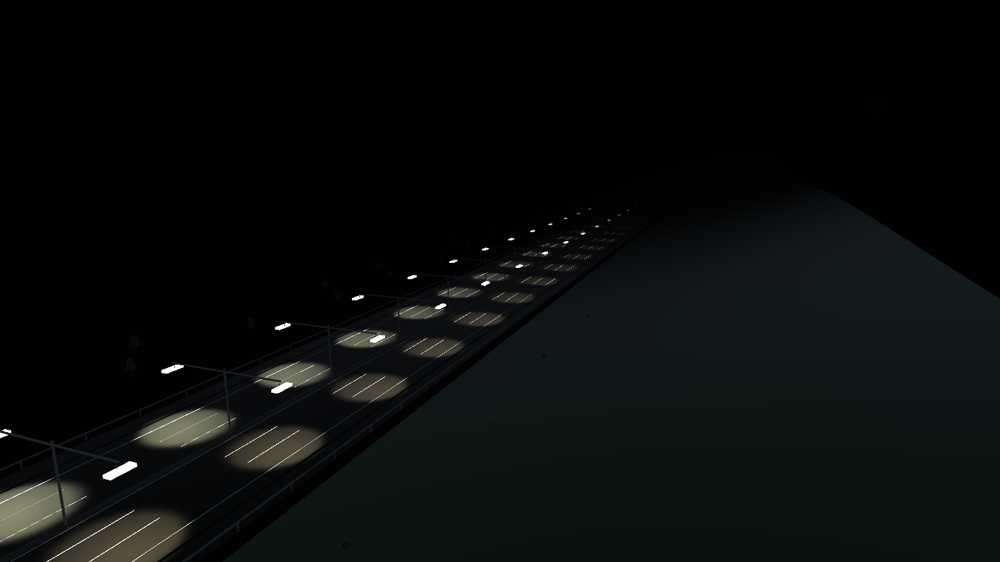
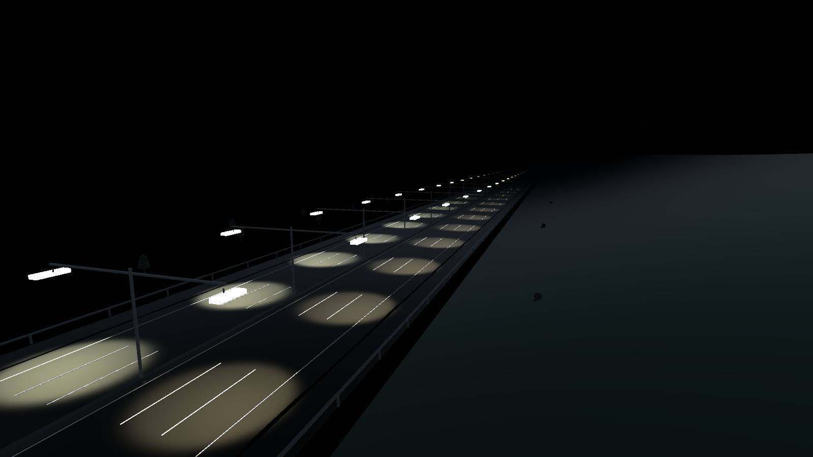

# ReLight-X

Emergency-aware adaptive highway lighting digital twin with virtual edge-controller board simulation.



## Summary

ReLight-X is a simulation-first prototype for a smart highway lighting system. It models a six-lane road, directional pole luminaires, traffic scenarios, emergency-vehicle response, fault fallback behavior, energy saving, luminaire health, and virtual edge-controller board behavior.

The project is built for research, portfolio, and demonstration use. It does not claim certified road deployment, real photometric compliance, or tested physical hardware. The current version focuses on software simulation, Unity visualization, a Wokwi STM32 board model, and repeatable validation without real devices.

## What It Does

- Simulates normal traffic, emergency vehicles, sensor faults, communication loss, and degraded luminaires.
- Keeps idle highway lights at 30 percent eco brightness.
- Raises only the affected travel direction for normal traffic.
- Raises emergency lighting for ambulance, police, and fire-truck scenarios.
- Estimates adaptive energy use against an always-on baseline.
- Tracks luminaire health, temperature, current, fault state, and Re-X lifecycle decision.
- Provides a Unity 6 night-road digital twin with selectable vehicles and clickable luminaires.
- Provides a Streamlit dashboard for energy, health, passport, scenario, and board-network views.
- Provides a Wokwi STM32 pole-node simulation with sensors, PWM outputs, fault/test buttons, and RS485/CAN-style indicators.
- Provides a five-node board-network simulator for a small pole-controller network.

## Screenshots

### Unity Digital Twin


### Road Lighting Wave



The screenshots above are exported from the Unity scene using:

```text
Unity menu -> ReLight-X -> Export README Screenshots
```

## Tech Stack

- Python simulation backend
- Streamlit dashboard
- pandas and Plotly for dashboard data views
- MQTT with optional local `amqtt` broker and `paho-mqtt` client
- Unity 6.3.6f1 digital twin project
- Wokwi STM32 board simulation
- PlatformIO firmware build workflow
- KiCad placeholder/project notes for future PCB work
- Optional ROS 2/Gazebo skeleton for future experiments

## Project Structure

```text
backend/                  Python simulation, control, energy, health, passports
dashboard/                Streamlit command center
unity_projects/           Full Unity 6 project for the digital twin
unity_digital_twin/       Lightweight legacy Unity setup notes/scripts
board_simulation_wokwi/   STM32 Wokwi pole-node simulation
board_design/             Board concept, BOM, pin map, PCB visuals, 3D models
edge_controller_firmware/ ESP32 lab firmware path kept as a fallback
data/                     Generated sample data and validation artifacts
docs/                     Research notes, thesis/report documentation, images
tests/                    Backend unit tests
tools/                    Validation, MQTT broker, and board-network utilities
ros2_gazebo_optional/     Minimal optional ROS 2/Gazebo skeleton
```

## How It Works

1. The backend creates a highway layout with poles, luminaires, zones, and sensors.
2. A scenario spawns vehicles and optional faults.
3. Sensor simulation reports vehicle proximity and environment values.
4. The lighting controller calculates brightness targets per luminaire.
5. Energy, health, remaining useful life, and passport records are updated.
6. The dashboard and generated data files show the resulting system state.
7. Unity visualizes the night highway and adaptive lighting behavior.
8. Wokwi and the board-network simulator cover the embedded-board side.

## Setup

From the project root:

```bash
python3 -m venv .venv
source .venv/bin/activate
pip install -r requirements.txt
python -m backend.main --write-sample-data
```

## Run Backend Scenarios

```bash
source .venv/bin/activate
python -m backend.main --scenario normal_car_direction_a --steps 90
python -m backend.main --scenario emergency_ambulance_direction_a --steps 90
python -m backend.main --scenario two_cars_opposite --steps 120
```

Available scenarios:

```text
empty_highway
normal_car_direction_a
normal_car_direction_b
two_cars_opposite
emergency_ambulance_direction_a
police_fire_direction_b
sensor_fault
communication_loss
degraded_luminaire
```

## Run the Dashboard

```bash
source .venv/bin/activate
streamlit run dashboard/app.py
```

Open:

```text
http://127.0.0.1:8501
```

Dashboard pages include command center, overview, highway map, energy, health, digital passport, board network, and board test.

## Open the Unity Digital Twin

Open this folder in Unity Hub:

```text
unity_projects/ReLightX_Unity6
```

Recommended Unity version:

```text
Unity 6.3.6f1
```

If the scene does not appear automatically:

```text
Unity menu -> ReLight-X -> Build Unity 6 Highway Scene
```

Then open:

```text
Assets/ReLightX/Scenes/ReLightXHighway.unity
```

Press Play to run the digital twin. The Unity scene is visualization-only; board simulation is handled separately in Wokwi and the board-design tools.

## Run the Wokwi STM32 Board Simulation

Open the Wokwi folder:

```bash
cd board_simulation_wokwi
python3 tools/run_platformio.py run
```

Then open `diagram.json` in VS Code and press the Wokwi Play button.

The virtual board includes:

- STM32 Blue Pill target
- two luminaire PWM outputs
- ambient light proxy
- radar/PIR/ultrasonic presence inputs
- NTC temperature input
- line-voltage input
- vehicle A/B buttons
- emergency, test, fault, and bus-fault buttons
- RS485/CAN-style activity indicators
- logic analyzer channels

## Run the Five-Node Board Network Demo

```bash
source .venv/bin/activate
python tools/run_board_network_demo.py
```

Then open the dashboard and select:

```text
Board Network
```

## Optional MQTT Demo

Start a local broker:

```bash
source .venv/bin/activate
python tools/run_mqtt_broker.py
```

In another terminal:

```bash
source .venv/bin/activate
python -m backend.main --scenario emergency_ambulance_direction_a --mqtt
```

## Test and Validate

Run unit tests:

```bash
source .venv/bin/activate
python -m unittest discover -s tests
```

Run the full validation package:

```bash
source .venv/bin/activate
python tools/run_thesis_validation.py
```

If the Wokwi firmware has already been built:

```bash
python tools/run_thesis_validation.py --skip-wokwi-build
```

Validation output is written to:

```text
data/runs/thesis_validation/validation_report.json
data/runs/thesis_validation/validation_summary.md
```

## Known Limitations

- The project uses simulated traffic and simulated sensor values.
- The Unity scene is a visual digital twin, not certified photometric road-lighting software.
- Wokwi validates firmware behavior but does not replace electrical testing.
- KiCad files are placeholders and notes, not fabrication-ready PCB files.
- The board design is a lab/research concept and is not certified for roadside use.
- Real deployment would require hardware validation, electrical safety review, EMC/surge testing, cybersecurity, luminaire-driver validation, and road authority approval.

## Future Improvements

- Integrate real mmWave radar packets.
- Build and test a physical STM32 pole-node board.
- Create a full KiCad schematic and PCB layout with ERC/DRC.
- Add real 0-10V or certified DALI/D4i dimming hardware.
- Calibrate energy and thermal models using physical measurements.
- Add secure MQTT authentication and TLS for connected demos.
- Extend the Unity scene with measured photometric data when available.

## License

This project is licensed under the MIT License. See [LICENSE](LICENSE).

Third-party visual assets used by the Unity scene are included with their original license/source notes:

- Kenney Car Kit: Creative Commons Zero, CC0.
- Poly Haven Street Lamp 01: CC0.

## Author

Author: Amin Zoroufi  
Role: AI Researcher / XR Developer  
Location: Dubai, UAE  
Email: aminn.zoroufi@gmail.com  
LinkedIn: [linkedin.com/in/amin-zoroufi](https://www.linkedin.com/in/amin-zoroufi/)  
GitHub: [github.com/aminzoroufi](https://github.com/aminzoroufi)  
Portfolio: [aminzoroufi.github.io](https://aminzoroufi.github.io/)

## Repository Status

This repository is prepared as a public portfolio/research prototype.
