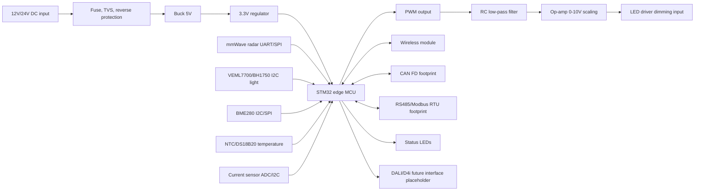

# ReLight-X Edge Controller Board Network

The ReLight-X Edge Controller Board started as an ESP32/ESP32-S3 lab demonstrator. The recommended next prototype is a five-node STM32 edge-controller network with wireless inter-board communication and RS485/CAN footprints for industrial local buses. It is not a certified roadway lighting product.

## Board Role

- Receive adaptive brightness commands from the wireless gateway or local fallback controller.
- Read simulated or physical sensor inputs.
- Output PWM and a lab-scale 0-10V dimming signal.
- Publish health, current, temperature, communication, and fault telemetry.
- Fall back to safe brightness if communication, sensor, or controller health is degraded.

## Added Implementation Assets

- Detailed implementation plan: `implementation/edge_controller_implementation.md`
- Five-node board network architecture: `implementation/five_node_network_architecture.md`
- PCB layout guide: `implementation/pcb_layout_guide.md`
- Pole integration detail: `implementation/pole_integration.md`
- Five-node board map: `five_node_board_map.csv`
- PCB visual inspection files: `pcb_visualization/pcb_viewer.html`
- Static 3D model: `3d_model/relightx_edge_controller_board.obj`
- Static five-node 3D network model: `3d_model/relightx_five_node_network.obj`
- Static 3D model material file: `3d_model/relightx_edge_controller_board.mtl`

Board behavior simulation is now separated from Unity and lives in `../board_simulation_wokwi/`.

Recommended tool split:

- Unity 6: digital twin visualization only.
- Wokwi: STM32 pole-node behavior simulation with RS485/CAN, sensors, and quick function tests.
- KiCad: schematic, PCB layout, routing, manufacturing outputs, and 3D PCB preview.

## Block Diagram

## Five-Node Pole Demo

The five-node version models five independent boards:

- `RLX-N01` to `RLX-N05`
- one luminaire per board
- one local sensor stack per board
- wireless link to the gateway
- RS485/CAN footprints for industrial local/fallback communication

See `five_node_board_map.csv` and `implementation/five_node_network_architecture.md`.

## 0-10V Dimming Circuit Concept

1. STM32 timer PWM pin outputs a 0-3.3V PWM waveform.
2. RC low-pass filter converts duty cycle to a smooth analog voltage.
3. Rail-to-rail op-amp stage scales 0-3.3V to 0-10V using a stable 10V reference or 12V rail.
4. Series protection resistor and TVS/ESD protection protect the LED driver dimming input.
5. Output terminal connects to the LED driver's 0-10V or 1-10V dimming input.

This circuit is a design concept for lab validation. Real deployment must follow the exact luminaire driver datasheet, isolation requirements, surge protection requirements, and local electrical safety standards.

## DALI/D4i Future Interface Placeholder

DALI and D4i are not implemented in the firmware prototype. A future deployment should add:

- Certified DALI physical layer transceiver.
- DALI bus power and isolation design as required by the selected driver.
- DALI protocol stack.
- D4i/Zhaga connector integration with certified components.
- Compliance testing before field deployment.

## Target Luminaire Class

The architecture targets real-world LED roadway luminaires with dimmable drivers, similar to:

- Schreder IZYLUM / IZYLUM NEO / NEOS GEN2 style roadway luminaires.
- Philips/Signify Luma gen2 or RoadFocus LED style roadway luminaires.
- Any Zhaga-D4i or NEMA 7-pin compatible LED roadway luminaire with a dimmable driver.

## Lab Test Without Highway Lights

- Use GPIO PWM to dim a small LED module or LED strip.
- Use a multimeter or oscilloscope to verify PWM duty cycle.
- Build the RC/op-amp stage only with safe low-voltage lab supplies.
- Run the Python backend and Streamlit dashboard in simulation mode.
- Add the STM32 node or a lab bridge to the MQTT broker for HIL telemetry.
