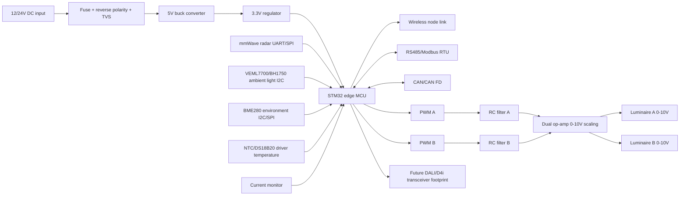

# ReLight-X Edge Controller Board Implementation

This document upgrades the earlier concept into a buildable lab implementation plan. It is still not a certified roadside controller.

Use Wokwi for firmware behavior simulation and KiCad for schematic/PCB/3D board work. Unity is intentionally not used to show the board anymore; Unity is the highway digital twin visualization.

For the next hardware iteration, use the five-node STM32 network design in `five_node_network_architecture.md`. The Wokwi lab board now follows the same STM32 direction and includes RS485/CAN indicators, while the field-like board should add real isolated transceivers and a wireless module.

## Physical Mounting on Pole

The controller board is represented in Unity as an IP-rated enclosure mounted below the luminaire arm on each pole.

Recommended lab/demo mounting concept:

- Enclosure: IP65/IP66 polycarbonate or aluminium electronics box.
- Mounting height in demonstrator: below luminaire cross-arm, reachable for maintenance.
- Cable glands:
  - Power input gland.
  - Dimming output gland to Luminaire A/B drivers.
  - Sensor harness gland for radar, ambient, current, and temperature sensors.
- Internal stack:
  - Backplate.
  - PCB mounted on four standoffs.
  - STM32 MCU and certified wireless module kept away from noisy power and metal antenna obstructions.
  - Terminal blocks on lower/right edge for easy wiring.

## Functional Blocks

## Connector Plan

| Connector | Purpose | Suggested terminal |
| --- | --- | --- |
| J1 | 12/24V DC input | 2-pin screw terminal |
| J2 | Luminaire A 0-10V dimming output | 2-pin screw terminal |
| J3 | Luminaire B 0-10V dimming output | 2-pin screw terminal |
| J4 | DALI/D4i future placeholder | 2-pin isolated terminal footprint |
| J5 | mmWave radar UART | 4-pin JST or screw terminal |
| J6 | I2C sensors | 4-pin header |
| J7 | current sensor input | 3/4-pin header |
| J8 | manual override and fault input | 3-pin header |
| J9 | RS485/Modbus RTU | 3/4-pin terminal |
| J10 | CAN/CAN FD | 3/4-pin terminal |
| J11 | wireless module / antenna | module footprint plus u.FL/SMA option |

## 0-10V Dimming Implementation

For each dimming channel:

1. STM32 timer PWM at 5 kHz or higher.
2. RC filter, example starting values:
   - R = 10 kOhm
   - C = 4.7 uF
   - cutoff about 3.4 Hz
3. Op-amp non-inverting gain stage:
   - 0-3.3V input scaled to 0-10V output.
   - Gain about 3.03.
4. Series output resistor, example 1 kOhm.
5. TVS/ESD protection at terminal.
6. Common reference to dimming driver reference only if the driver datasheet permits it.

Use a rail-to-rail op-amp that can support the required output swing from the chosen supply. Validate ripple, response time, and driver compatibility before connecting real luminaires.

## Firmware Mapping

The Wokwi firmware in `board_simulation_wokwi/sketch.ino` maps:

- PB6 -> Luminaire A PWM.
- PB7 -> Luminaire B PWM.
- PB14/PB15 -> simulated RS485 driver-enable and TX activity.
- PA11/PA12 -> simulated CAN TX/RX monitor.
- PA0 -> ambient light proxy.
- PA1 -> radar/mmWave proxy slider.
- PA2 -> NTC pole temperature.
- PA3 -> line-voltage proxy.
- PB10/PB12/PB13 -> PIR and ultrasonic vehicle presence inputs.
- PA4/PA5/PA6/PA7/PB0/PB1 -> fault, test, vehicle A, vehicle B, emergency, and bus fault buttons.

The STM32 firmware should map the same logical signals to timer PWM, USART radar, I2C sensor bus, ADC temperature/current, FDCAN, RS485 UART, and wireless module SPI/UART.

## Lab Build Path

1. Run the Python backend and Streamlit dashboard without hardware.
2. Run `board_simulation_wokwi/` in Wokwi to validate PWM, RS485/CAN activity, sensor triggers, test mode, fault mode, and telemetry logic.
3. Flash STM32 firmware or run the Wokwi STM32 firmware and publish commands from the dashboard Board Test page.
4. Verify GPIO PWM with an oscilloscope.
5. Add a small LED module load.
6. Add RC/op-amp 0-10V circuit on breadboard.
7. Measure 3V, 7V, and 10V analog levels.
8. Move to PCB only after the circuit is stable.

## Field Deployment Gap

Before real highway use, the design needs certified enclosure, surge/EMC review, electrical safety review, DALI/D4i compliance if used, secure communication, and road authority approval.
