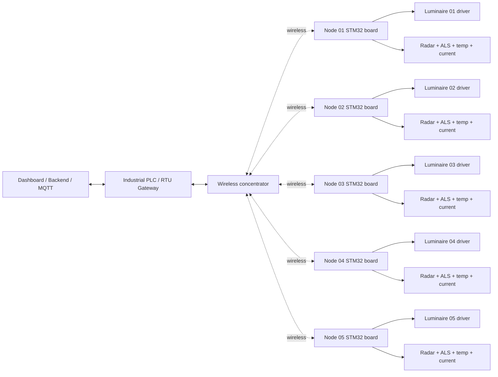

# ReLight-X Five-Node Board Network Architecture

This file upgrades the board concept from one controller into a realistic five-node pole network. It is still a research prototype, not a certified roadside lighting product.

## Recommended Architecture

Use a hybrid industrial topology:

- Per-pole controller: STM32 edge controller board.
- Inter-board communication: wireless mesh/star link to a gateway.
- Local industrial bus on each node: isolated RS485/Modbus RTU and/or CAN FD.
- Gateway: industrial PLC/RTU or rugged Linux/STM32 gateway in the roadside cabinet.
- Luminaire control: 0-10V prototype output now, DALI/D4i/Zhaga path later.

Why this split:

- STM32 is a better fit than ESP32 for a rugged controller because it has deterministic timing, industrial peripheral choices, and strong CAN/FDCAN support.
- Wireless between poles avoids pulling a data cable along every pole.
- RS485/CAN stays useful for local cabinet/pole harnesses, maintenance ports, driver interfaces, and wired fallback.
- A PLC/RTU is best used as the zone gateway, safety interlock, and SCADA bridge, not as an expensive controller on every pole.

## Network Diagram



## Five Board Roles

| Node | Pole | Luminaire | Main event in demo | Sensors mounted | Output behavior |
| --- | --- | --- | --- | --- | --- |
| RLX-N01 | Pole 1 | Light 1 | Vehicle enters zone | mmWave radar, VEML7700/BH1750, BME280, NTC/DS18B20, current sensor | Raises light before vehicle reaches pole |
| RLX-N02 | Pole 2 | Light 2 | Vehicle approaching | Same stack | Goes to high brightness and sends detection upstream |
| RLX-N03 | Pole 3 | Light 3 | Vehicle passing under pole | Same stack | Peak brightness, logs current/thermal response |
| RLX-N04 | Pole 4 | Light 4 | Vehicle leaving node | Same stack | Holds brightness, then fades to 30 percent |
| RLX-N05 | Pole 5 | Light 5 | Downstream pre-lighting | Same stack | Prepares next zone or returns to eco if no traffic |

## Per-Node Hardware Blocks

Each pole-node board should include:

- STM32 MCU, recommended class: STM32G0/G4/H5 with CAN or FDCAN depending final cost and availability.
- Isolated CAN FD transceiver footprint for local bus or wired fallback.
- Isolated RS485 transceiver footprint for Modbus RTU sensors/maintenance.
- Wireless module footprint, such as sub-GHz/LoRa, 802.15.4, Wi-Fi HaLow, LTE-M/NB-IoT, or a certified module selected for the deployment country.
- 12/24V input protection: fuse, TVS, reverse polarity protection, common-mode filtering.
- 5V buck and 3.3V regulator.
- 0-10V dimming output for prototype driver control.
- DALI/D4i/Zhaga physical-layer placeholder for future certified luminaire integration.
- Sensor connectors with ESD protection and cable shielding plan.

## Sensor Choice

Recommended prototype stack:

- mmWave radar: primary vehicle presence, direction, and speed trigger. Use UART/SPI depending selected module.
- VEML7700 ambient light sensor: preferred over BH1750 for the next prototype because it has high accuracy, I2C, and a wide measurement range. BH1750 is acceptable for low-cost lab demos.
- BME280: enclosure air temperature, humidity, and pressure for environmental telemetry.
- NTC thermistor: direct board/driver hotspot measurement.
- DS18B20: optional cable-mounted luminaire or driver temperature probe.
- Current/energy monitor: INA226/INA228 class for low-voltage lab loads; isolated current transducer for field hardware.

## STM32 Pin/Interface Allocation

| Function | Interface | Suggested signal |
| --- | --- | --- |
| 0-10V dimming PWM | Timer PWM | PWM_DIM_OUT |
| DALI/D4i placeholder | UART/timer + transceiver | DALI_TX/RX |
| mmWave radar | UART or SPI | RADAR_TX/RX or RADAR_SPI |
| VEML7700/BH1750 | I2C | I2C1_SCL/SDA |
| BME280 | I2C/SPI | Shared I2C or SPI |
| NTC | ADC | ADC_TEMP_DRIVER |
| Current monitor | I2C/ADC | I2C_CURRENT or ADC_CURRENT |
| RS485 | UART + DE/RE GPIO | MODBUS_TX/RX/DE |
| CAN/CAN FD | FDCAN + transceiver | CAN_TX/RX |
| Wireless module | SPI/UART | RADIO_SPI or RADIO_UART |
| Local override | GPIO input | FAULT_IN / TEST_IN |
| Status LEDs | GPIO output | LED_HEALTH / LED_LINK |

## Wireless Behavior

Each board publishes compact telemetry to the gateway:

```json
{
  "node_id": "RLX-N03",
  "pole_id": "P003",
  "vehicle_detected": true,
  "vehicle_speed_mps": 11.8,
  "ambient_lux": 3.2,
  "driver_temp_c": 49.5,
  "current_ma": 620,
  "brightness": 1.0,
  "link_rssi_dbm": -72,
  "fault": "none"
}
```

The gateway sends zone commands:

```json
{
  "zone_id": "Z00",
  "target_brightness": 0.85,
  "hold_seconds": 3.2,
  "reason": "vehicle_approach"
}
```

## PLC / RTU Option

Use an industrial PLC/RTU when the goal is a field-like cabinet:

- PLC/RTU reads wireless node telemetry through a gateway module.
- PLC/RTU supervises fail-safe states, cabinet power, maintenance override, and SCADA.
- Pole nodes remain STM32 boards because they are smaller and cheaper per pole.
- RS485/Modbus RTU can connect cabinet sensors, energy meters, and maintenance tools.
- CAN/CAN FD can connect short local runs where deterministic timing is useful.

## Fail-Safe Rules

- If wireless is lost: each node holds last valid command briefly, then moves to safe brightness.
- If radar fails: node uses neighbor detections and ambient light to choose fallback brightness.
- If current is abnormal: node reports a driver/load fault and limits output.
- If temperature is high: node derates brightness and reports thermal warning.
- If gateway is down: local nodes continue autonomous eco/adaptive behavior.

