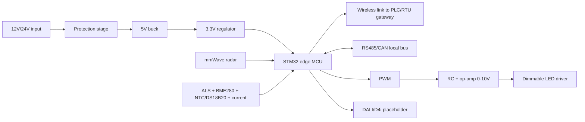

# Hardware Architecture

The board concept is intentionally retrofit-oriented. The current Wokwi demonstrator uses an STM32 Blue Pill style node, and the recommended research-grade hardware path is a five-node STM32 pole-controller network with wireless communication to a gateway and RS485/CAN footprints for industrial local buses.

## Sensing Strategy

Core detection uses mmWave radar because it can detect presence, range, speed, and movement direction without requiring a trained vision model. In the prototype, radar readings are simulated from vehicle positions.

Additional sensors:

- Ambient light sensor for day/night and environmental brightness. VEML7700 is preferred for the next board; BH1750 remains acceptable for low-cost lab testing.
- Current sensor for energy and abnormal current monitoring.
- BME280 for enclosure environment.
- NTC or DS18B20 for LED driver/luminaire temperature health.
- Optional camera feed for emergency vehicle classification.

LiDAR is not required. It can be considered only as a future premium sensor for tunnels, accident-prone locations, or complex intersections.

## Edge Controller

The ReLight-X lab board now uses an STM32 simulation target. The physical pole-node board should use STM32 plus a certified wireless module.

Power:

- 12V/24V DC input.
- Buck converter to 5V.
- Regulator to 3.3V.
- Fuse, surge, reverse polarity, and overvoltage placeholders.

Inputs:

- mmWave radar via UART or SPI.
- Ambient light via I2C.
- Temperature via ADC/I2C/1-Wire.
- Current sensor via ADC or I2C.
- Optional camera handled by a separate edge vision module.
- Manual override and fault input.

Outputs:

- PWM dimming output.
- Simulated 0-10V output circuit.
- Optional DALI/D4i future interface.
- Status LEDs.
- Optional relay/safety output.

Communication:

- Wireless node link to the PLC/RTU gateway for the five-board prototype.
- RS485/Modbus RTU and CAN/CAN FD footprints for local industrial bus, service, and wired fallback.

## Edge Controller Block Diagram

See `board_design/` for BOM, pin map, KiCad placeholders, and board test plan.
