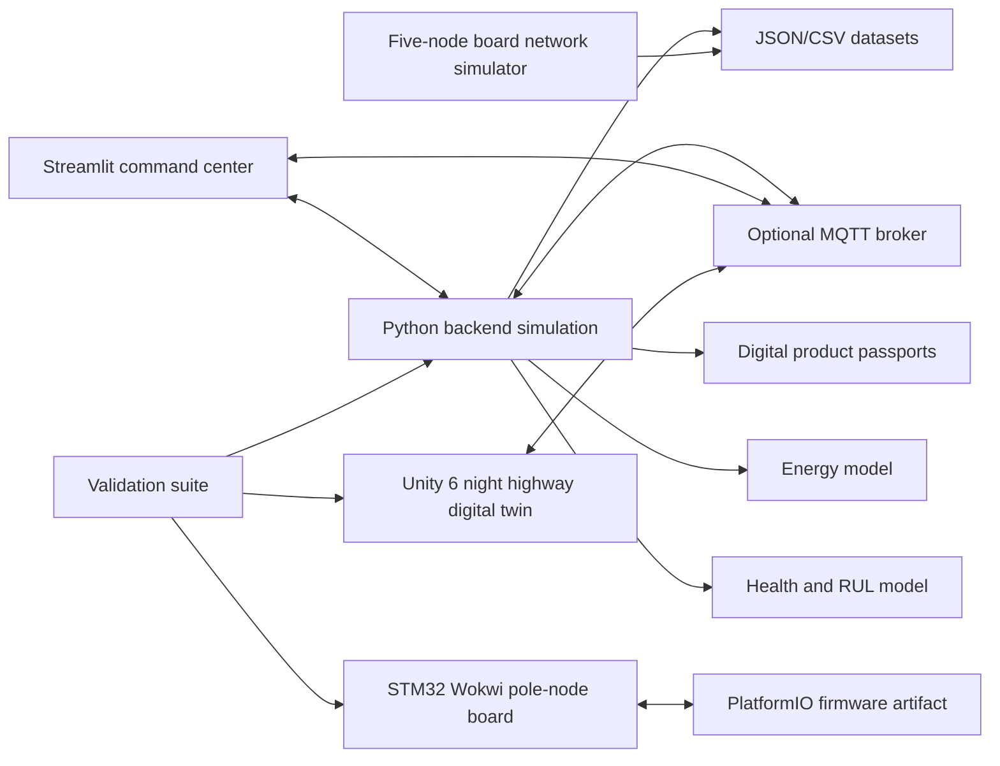

# ReLight-X: Emergency-Aware Adaptive Highway Lighting Digital Twin with Virtual Edge-Controller Board Validation

## Abstract

I designed and implemented ReLight-X as a research-grade, simulation-first prototype for adaptive highway lighting. The project addresses the problem of fixed-intensity night road lighting, where luminaires often operate at full output even when traffic is low, emergency conditions are not explicitly prioritized, and asset health is not continuously tracked. My objective was to create a complete demonstrator that can be evaluated without access to physical roadway luminaires, physical pole infrastructure, real embedded boards, real radar sensors, or a controlled road test site.

The system integrates a Python simulation backend, a Streamlit command dashboard, a Unity 6 digital twin, an STM32/Wokwi virtual pole-node board, a five-node board-network simulator, MQTT communication interfaces, digital product passports, energy accounting, health monitoring, and Re-X lifecycle classification. Normal vehicles trigger direction-specific sequential lighting waves. Emergency vehicles activate full-brightness safety response in the active travel direction. Fault scenarios such as sensor failure, communication loss, and degraded luminaire drivers force safe fallback behavior. The Unity scene visualizes a night highway through a green mountain valley with selectable vehicles, clickable luminaires, live energy savings, per-light process details, and adaptive pole lighting. The Wokwi board simulation validates two luminaire dimming outputs, sensor proxies, test buttons, RS485/CAN activity indicators, thermal and voltage conditions, and serial telemetry.

The work is intentionally transparent. The current prototype does not claim real photometric certification, electrical safety certification, road authority approval, or trained computer vision performance. Instead, I focused on a defensible engineering workflow: a repeatable simulation architecture, clearly defined datasets, explicit assumptions, automated validation, virtual embedded testing, and a practical path toward future STM32 hardware, certified DALI/D4i interfaces, physical mmWave radar, and calibrated field measurement.

## Acknowledgements

I would like to acknowledge the academic and technical communities whose open tools, public standards, and educational resources made this prototype possible. I also acknowledge the maintainers of Python, Unity, Streamlit, Plotly, Wokwi, PlatformIO, KiCad, ROS 2, and the open asset providers whose permissive visualization resources supported the demonstration layer. Finally, I acknowledge the supervisors, reviewers, and examiners who evaluate engineering work not only by its final result but also by the clarity of its assumptions, limitations, and validation method.

## Table of Contents

1. Introduction
2. Problem Definition
3. Literature Review
4. System Requirements
5. System Architecture
6. Dataset Analysis
7. Methodology
8. Detailed File-by-File Repository Explanation
9. Computer Vision Pipeline
10. Machine Learning Components
11. Robotics and Navigation Components
12. Digital Twin Design
13. API and Backend Services
14. Experimental Setup
15. Evaluation and Results
16. Limitations
17. Future Work
18. Thesis Defense Questions and Answers
19. Conclusion
20. References

## Introduction

Roadway lighting is a critical public infrastructure system. It contributes to driver visibility, pedestrian visibility, perceived safety, and emergency response. However, conventional highway lighting is usually operated through fixed schedules or simple time-based dimming. This means a road can remain fully illuminated even when no vehicles are present. At the same time, an emergency vehicle may receive no explicit lighting priority beyond the ordinary static illumination pattern. Maintenance is also often reactive: faults are discovered after visible failure, routine inspection, or complaint.

I designed ReLight-X to explore a different approach. Instead of treating lighting poles as isolated electrical assets, I modelled them as networked cyber-physical nodes. Each pole has directional luminaires, local sensing, edge control, communication state, health state, and a digital record. The highway is represented as both a computational model and a visual digital twin. Vehicle movement, sensor detections, adaptive control, energy saving, fault handling, and lifecycle decisions are observable in one integrated workflow.

The main practical constraint was that I did not assume access to real roadway lighting infrastructure. Therefore, I built the project as a complete simulation and validation environment. This decision shaped the project in four ways.

First, I implemented a deterministic Python backend that can run scenarios repeatedly. This allows the same traffic, fault, energy, and health behavior to be tested automatically.

Second, I built a Unity 6 digital twin that visualizes the system at night. Unity is used for the highway environment, moving vehicles, selectable camera modes, luminaires, visual lighting response, and live digital-twin telemetry. I intentionally separated Unity from PCB simulation because the visual twin should communicate road behavior, not become a circuit-design tool.

Third, I implemented the board layer separately in Wokwi and Python. The Wokwi simulation represents one STM32 pole-node board with sensors, outputs, bus indicators, and test buttons. The Python five-node simulator represents a small pole network connected to an industrial gateway.

Fourth, I created a validation script that checks backend scenarios, board files, firmware artifacts, five-node network behavior, the classifier interface, and Unity feature presence. This gives the project an evidence set suitable for thesis demonstration even when physical devices are unavailable.

### Possible Examiner Questions

**Question:** Why did I make this project simulation-first instead of building hardware immediately?

**Suggested answer:** I made the project simulation-first because the research goal was to validate architecture, control logic, visualization, board behavior, and test methodology without requiring highway access or physical luminaires. This approach allowed me to create repeatable scenarios, run automated validation, and identify implementation risks before moving to real hardware.

**Question:** What is the core contribution of ReLight-X?

**Suggested answer:** The core contribution is the integration of adaptive roadway lighting control, emergency response, virtual embedded-board validation, energy and health modelling, digital product passports, and a Unity digital twin into one repeatable no-hardware prototype.

**Question:** Is ReLight-X a finished road-certified system?

**Suggested answer:** No. I designed ReLight-X as a research prototype. It demonstrates software, simulation, visualization, and virtual board behavior. A certified deployment would require photometric design, electrical safety, EMC, surge protection, cybersecurity, DALI/D4i compliance where applicable, environmental testing, and approval from the responsible road authority.

## Problem Definition

The engineering problem can be stated as follows:

I needed to design and validate an adaptive highway lighting system that can reduce unnecessary energy consumption, increase lighting response near vehicles, prioritize emergency vehicles, identify fault conditions, and report asset health without relying on physical road infrastructure during the prototype stage.

The problem contains several subproblems.

### Energy Inefficiency

Traditional night lighting often uses fixed brightness profiles. A static system is simple, but it wastes energy when traffic density is low. In ReLight-X, the default state is 30 percent eco brightness, and the system increases only the relevant directional luminaires around active traffic. This creates an adaptive lighting wave instead of lighting the entire road at full output.

### Directional Control

A highway has two traffic directions. If a vehicle travels in Direction A, lighting Direction B at the same intensity is usually unnecessary unless there is a fault, emergency, or policy requirement. I represented each pole with two independent luminaires, one for Direction A and one for Direction B. This makes the controller direction-aware.

### Emergency Response

Emergency vehicles require stronger safety response. In the backend, ambulance, police, and fire-truck scenarios activate emergency zones in the relevant direction. In the Unity visual twin, an emergency vehicle activates full-direction lighting for the active A or B path so the emergency condition is clearly visible.

### Multi-Vehicle Interaction

A realistic controller must handle multiple vehicles. A common bug in simple lighting logic is that only the first or selected vehicle affects the light state. I addressed this by aggregating all active vehicles in the Unity lighting loop and all active scenario vehicles in the backend controller. Each luminaire stores detected vehicle IDs, active vehicle count, nearest distance, and the process reason used to set brightness.

### Fault Handling

Real systems cannot fail silently. I modelled sensor faults, communication loss, and degraded luminaires. Faults drive affected luminaires to a safe fallback brightness and update fault history, health score, and digital product passport records.

### Hardware Feasibility Without Physical Boards

A thesis prototype still needs to show how the system could be implemented on a board. I therefore separated physical implementation into Wokwi and board-design artifacts. The Wokwi STM32 simulation checks firmware behavior, input controls, PWM outputs, RS485/CAN-style indicators, and telemetry. The board-design folder explains STM32 hardware blocks, sensors, power, 0-10V dimming, RS485/CAN, wireless communication, and future DALI/D4i integration.

### Defensible Validation

The final problem is evaluation. Without field hardware, I needed repeatable proof that the system works at the simulation level. I implemented `tools/run_thesis_validation.py` to run unit tests, backend scenario validation, Wokwi file validation, firmware artifact validation, five-node network validation, classifier interface validation, and Unity feature validation.

### Possible Examiner Questions

**Question:** Why is direction-aware lighting important?

**Suggested answer:** I used direction-aware lighting because a dual-carriageway road does not always need both sides illuminated at the same intensity. By controlling Direction A and Direction B independently, the system can save energy while still providing full output where a vehicle or emergency event actually requires it.

**Question:** Why did I include fault scenarios?

**Suggested answer:** I included fault scenarios because adaptive systems must be safe under degraded conditions. If a sensor or communication path fails, the controller should not simply remain dark. In my design, faults produce safe fallback brightness and visible diagnostic telemetry.

**Question:** What makes this more than a visual animation?

**Suggested answer:** The project is more than animation because the backend computes state, energy, health, faults, and passports; the Wokwi firmware simulates board-level inputs and outputs; the dashboard visualizes system data; and the validation script checks behavior automatically.

## Literature Review

Adaptive roadway lighting belongs to the wider area of smart infrastructure and smart-city systems. The relevant literature and standards can be grouped into road lighting guidance, adaptive lighting research, digital-twin research, IoT messaging, embedded board simulation, and luminaire communication interfaces.

### Road Lighting Guidance

Road lighting guidance such as CIE 115 discusses lighting for roads used by motor and pedestrian traffic. CIE notes that power consumption and environmental factors became more important as electronic control gear made adaptive road lighting possible. I used this principle as a theoretical justification for adaptive dimming: the goal is not simply to minimize light output, but to adapt output while preserving the intended visual service.

I did not attempt to calculate formal lighting classes, luminance uniformity, glare metrics, or threshold increment values. Those require photometric luminaire data, road surface reflectance data, mounting geometry, and certified lighting-design software. Instead, I implemented a functional control prototype that could later be calibrated against those road-lighting requirements.

### Adaptive Street and Highway Lighting Research

Adaptive street lighting research commonly combines sensors, communication, dimming profiles, and monitoring dashboards. Published work on smart street lighting shows that energy can be reduced when LED intensity responds to traffic and environmental conditions. I used this research direction to justify the ReLight-X control loop:

1. Detect traffic or emergency context.
2. Estimate which poles are affected.
3. Increase luminaires ahead of traffic.
4. Hold brightness long enough for safe passage.
5. Fade back to eco brightness.
6. Track energy and faults.

I selected a rule-based control strategy for the current prototype because it is transparent, deterministic, easy to defend, and suitable for simulation-only validation. Fully data-driven optimization or deep reinforcement learning would require a training environment, reward design, large scenario datasets, and safety verification. Those are valuable future directions but would be less defensible without real calibration data.

### Digital Twin Concepts

A digital twin is a virtual representation of a physical system or process that can mirror, simulate, inspect, and support decisions about its real counterpart. Smart-city digital twins are useful because they make infrastructure behavior visible. I used Unity as the visual digital twin layer and Python as the analytical twin layer. Unity shows the night road, vehicles, poles, light beams, selected vehicle cameras, and live telemetry. Python provides the deterministic state model and exports structured data.

The key design decision was to avoid using Unity as the only source of truth. Visual engines are excellent for perception and demonstration, but backend models are better for repeatable scenario evaluation, CSV/JSON outputs, and automated tests. Therefore, I separated visual state from analytical state.

### IoT Messaging and MQTT

MQTT is a lightweight publish/subscribe messaging protocol designed for constrained and IoT environments. I used MQTT topics as the optional integration layer between backend, dashboard, Unity, and board firmware. The backend can publish luminaire brightness, health, zone mode, system energy, vehicle state, and passport messages. The board firmware can receive commands and publish telemetry.

I selected MQTT because it is simple, widely used, easy to test locally, and fits the message-oriented nature of smart lighting. I did not implement a full SCADA protocol, OPC UA stack, or secured production broker because the prototype is not a certified deployment system. Security and authenticated transport are documented as future work.

### Embedded Board Simulation

Wokwi allows microcontroller behavior to be simulated through virtual boards, sensors, buttons, LEDs, logic analyzers, and firmware artifacts. PlatformIO provides reproducible firmware builds through `platformio.ini`. I used Wokwi and PlatformIO to show that the edge-controller logic can be tested without a physical STM32 board.

The Wokwi board is not a full electrical simulation. It does not model every industrial transceiver or real sensor IC exactly. I used it where it is strongest: GPIO, ADC, PWM, push buttons, virtual sensors, LEDs, serial telemetry, and logic analyzer signals. For PCB design and manufacturing, I documented KiCad as the correct tool.

### Dimming Interfaces and DALI/D4i

The prototype uses simulated PWM and a lab-scale 0-10V concept. For real luminaires, DALI/DALI-2/D4i and Zhaga-D4i are relevant because they support standardized lighting communication, addressability, data, and luminaire-side intelligence. I did not implement DALI in firmware because a correct implementation requires certified physical-layer hardware, protocol support, electrical design, bus power considerations, and compliance testing. I documented DALI/D4i as the future certified-interface path.

### Possible Examiner Questions

**Question:** Why did I not use a deep learning controller?

**Suggested answer:** I did not use a deep learning controller because the current project has no real traffic sensor dataset, no field-measured lighting outcomes, and no certified safety envelope. I selected rule-based adaptive control because it is transparent, deterministic, easy to validate, and appropriate for a simulation-first thesis prototype.

**Question:** Why did I use MQTT instead of a heavier industrial protocol?

**Suggested answer:** I used MQTT because the prototype needs lightweight publish/subscribe communication between backend, dashboard, Unity, and board firmware. It is easy to run locally, easy to inspect, and suitable for IoT-style telemetry. A field deployment could add SCADA integration, authentication, TLS, or another industrial protocol later.

**Question:** Why did I separate Unity and Wokwi?

**Suggested answer:** I separated Unity and Wokwi because they solve different problems. Unity is the visual digital twin for road behavior, while Wokwi is the virtual embedded-board simulation for firmware and IO testing. Combining them would make the project harder to validate and less clear.

## System Requirements

I defined the requirements in functional, non-functional, research, visualization, board, and safety categories.

### Functional Requirements

1. The system shall represent a six-lane highway with three lanes per direction.
2. The system shall support independent luminaires for Direction A and Direction B.
3. The default night state shall be eco brightness at 30 percent.
4. A normal vehicle shall activate a sequential lighting wave only in its travel direction.
5. An emergency vehicle shall activate 100 percent brightness in its active direction.
6. The system shall handle multiple vehicles simultaneously.
7. The controller shall not depend on the currently selected Unity camera vehicle.
8. The system shall represent faults and safe fallback brightness.
9. The backend shall calculate adaptive energy, baseline energy, saved energy, saved percentage, and CO2 avoided.
10. The system shall generate digital product passports for luminaires.
11. The board layer shall simulate dimming outputs, sensors, test inputs, fault inputs, and communication indicators.
12. The dashboard shall display control mode, energy, vehicles, faults, board network state, health, and passports.

### Non-Functional Requirements

1. The project shall run without real hardware.
2. The backend shall be deterministic enough for repeatable tests.
3. The Unity project shall be openable in Unity Hub with Unity 6.3.6f1.
4. The Wokwi project shall build through PlatformIO and run from VS Code.
5. The repository shall include documentation and validation evidence.
6. The implementation shall keep hardware simulation separate from visual simulation.
7. The prototype shall clearly state limitations and avoid claiming certification.

### Research Requirements

1. The project shall support thesis-style explanation and defense.
2. It shall include scenario-based validation.
3. It shall compare adaptive behavior against an always-on baseline.
4. It shall provide a future path toward real sensors, STM32 boards, DALI/D4i, and road authority validation.

### Visualization Requirements

1. The Unity scene shall represent a dark night environment.
2. The road shall be visible mainly from pole lights, vehicle headlights, small moonlight, lane markings, guardrails, and fog.
3. The scene shall include green mountain walls and roadside trees.
4. The scene shall provide vehicle camera modes: first-person, third-person, side-up-wide, overview, and cinematic.
5. Clicking a vehicle shall allow inspection and camera following.
6. Clicking a luminaire shall show its digital-twin details.
7. The UI shall allow spawning vehicles in Direction A and Direction B.
8. The UI shall allow changing the speed of only the selected vehicle.

### Board Requirements

1. The virtual board shall use STM32 as the current board direction.
2. It shall include two luminaire dimming channels.
3. It shall include ambient light, radar proxy, PIR, ultrasonic, temperature, voltage, manual test, fault, emergency, and bus-fault controls.
4. It shall expose RS485/CAN-style activity indicators and logic analyzer pins.
5. It shall print serial telemetry.
6. It shall support safe fallback behavior.

### Safety and Scope Requirements

The prototype shall not be presented as road-ready hardware. I explicitly treat electrical certification, photometric compliance, cybersecurity, real DALI/D4i compliance, environmental testing, surge/EMC validation, and road authority approval as future work.

### Possible Examiner Questions

**Question:** What requirement most strongly shaped the architecture?

**Suggested answer:** The strongest requirement was no-hardware validation. Because I could not rely on physical luminaires or boards, I designed the project around repeatable simulation, virtual board testing, and automated evidence generation.

**Question:** Why did I require selectable light details?

**Suggested answer:** I required selectable light details because a digital twin must expose state, not only visuals. When I click a luminaire, I can explain brightness, target, power, voltage, temperature, detected vehicles, process reason, health, fault, and Re-X status.

## System Architecture

The ReLight-X architecture separates the control brain, visual digital twin, dashboard, board simulation, generated datasets, validation, and optional robotics skeleton.



### Backend Layer

The backend is the analytical control layer. It defines the highway layout, generates vehicles, simulates sensors, computes lighting targets, updates energy and health models, generates digital passports, publishes MQTT messages, and writes run outputs. It is the part of the project most suitable for automated validation.

### Dashboard Layer

The Streamlit dashboard is the web command center. It embeds a `SimulationRuntime`, allows scenario stepping, displays metrics, plots a 3D status view, shows energy and health tables, displays passports, publishes board test commands, and visualizes the five-node board network.

### Unity Digital Twin Layer

The Unity 6 project is the main visual demonstration. It generates a night highway through a green mountain valley, 96 poles, 192 directional luminaires, random traffic, emergency vehicles, selectable camera views, UI controls, and per-light digital-twin panels. Unity can run offline using internal traffic simulation or optionally receive MQTT messages.

### Board Simulation Layer

The board layer has two parts. The first is a single-node Wokwi STM32 board simulation with firmware behavior. The second is a five-node Python network model that represents multiple pole controllers connected to a gateway with wireless RSSI and RS485/CAN health fields.

### Data Layer

The data folder stores generated sample data, scenario runs, layout definitions, passports, sensor records, time-series files, validation reports, and board-network telemetry. These are not raw field datasets. They are synthetic research artifacts generated by the project.

### Validation Layer

The validation script provides repeatable evidence. It checks unit tests, all backend scenarios, Wokwi diagram and build paths, firmware artifacts, five-node network behavior, classifier interface behavior, and Unity feature presence.

### Optional ROS2/Gazebo Layer

The ROS2/Gazebo folder is a future skeleton. I included it to show how a robotics-style simulation could later publish vehicle poses, bridge luminaire states, and represent highway poles in URDF/Xacro. It is not the main simulation engine.

### Possible Examiner Questions

**Question:** Why did I split the architecture into separate layers?

**Suggested answer:** I split the architecture so each concern can be tested independently. The backend validates control logic, Unity validates visual behavior, Wokwi validates board IO behavior, Streamlit validates monitoring and interaction, and the validation suite ties them together.

**Question:** What is the source of truth?

**Suggested answer:** For analytical results, the Python backend is the source of truth. For visual behavior during a Unity-only demo, Unity has its own visual traffic and lighting loop. I separated these intentionally so the backend can remain testable and the visual twin can remain interactive.

## Dataset Analysis

The project uses two categories of datasets: synthetic operational datasets generated by my simulation code and imported visualization assets used by Unity. It does not currently use an external real-world ML training dataset.

### Dataset 1: Highway Layout Dataset

**Exact dataset name:** `data/highway_layout.json`

**Source and provider:** Generated by my backend using `backend/highway_layout.py` and `backend/scenario_runner.py`.

**Purpose:** This dataset defines the analytical highway infrastructure for backend simulation.

**Why I selected it:** I needed a deterministic infrastructure representation with poles, luminaires, zones, and sensors. A generated dataset is suitable because the thesis evaluates control behavior rather than measured highway inventory.

**Acquisition method:** It is generated by running:

```bash
python -m backend.main --write-sample-data
```

**Licensing:** It is project-generated data and does not depend on an external dataset license.

**Structure:** It contains `config`, `poles`, `luminaires`, `zones`, and `sensors`.

**Number of samples:** The default backend layout contains 32 poles, 64 luminaires, 8 directional zones, and 32 sensor nodes.

**Classes/categories:** Directions are `A` and `B`. Zone modes include `eco`, `normal_vehicle`, `emergency`, `fault`, and `maintenance`.

**Preprocessing:** No cleaning is needed because the file is generated from dataclasses. Numeric values are already normalized to project units such as meters, watts, brightness ratio, and seconds.

**Train/validation/test split:** Not applicable. This is not a training dataset. It is a deterministic layout configuration.

**Limitations and biases:** The geometry is simplified. It assumes equal pole spacing, symmetric directions, uniform luminaire class, and simplified sensors.

**Alternatives rejected:** I did not use a GIS road asset inventory because the project has no specific deployment road. I also did not use measured photometric pole data because that would require real luminaire and road design data.

### Dataset 2: Vehicle Scenario Dataset

**Exact dataset name:** `data/vehicle_scenarios.json`

**Source and provider:** Generated from `backend/vehicle_simulator.py`.

**Purpose:** It describes traffic scenarios used for backend testing.

**Structure:** It is a JSON object with nine scenario names:

- `empty_highway`
- `normal_car_direction_a`
- `normal_car_direction_b`
- `two_cars_opposite`
- `emergency_ambulance_direction_a`
- `police_fire_direction_b`
- `sensor_fault`
- `communication_loss`
- `degraded_luminaire`

Each scenario contains vehicle spawns with time, vehicle ID, type, direction, lane, start position, and speed.

**Number of samples:** Nine scenario definitions. Most contain one vehicle. Two scenarios contain two vehicles. The empty scenario contains zero vehicles.

**Classes/categories:** Vehicle types are `normal_car`, `ambulance`, `police_car`, and `fire_truck`. Directions are `A` and `B`.

**Preprocessing:** Not needed because scenarios are generated from typed definitions.

**Augmentation:** Scenario variety is created through different vehicle types, directions, timing, speed, and fault events.

**Train/validation/test split:** Not applicable. These are deterministic test scenarios, not ML training data.

**Limitations:** Traffic is simplified to longitudinal movement along lanes. It does not model lane changes, acceleration profiles beyond simple speed movement, driver behavior, congestion waves, weather, or accidents.

**Alternatives rejected:** I did not use real traffic trajectory datasets because they would introduce privacy, licensing, localization, and calibration issues beyond the thesis scope.

### Dataset 3: Sensor Data Dataset

**Exact dataset name:** `data/sensor_data.csv`

**Source and provider:** Generated by `SensorSimulator` and `write_sample_data()`.

**Purpose:** It stores simulated sensor node status for the highway.

**Structure:** Columns include `node_id`, `pole_id`, `zone_id`, `radar_status`, `camera_status`, `ambient_light_lux`, `temperature`, `current_sensor_value`, `communication_status`, and `latest_detection`.

**Number of samples:** 32 rows, one per pole sensor in the backend default layout.

**Classes/categories:** Radar and communication states are categorical, such as `ok`, `fault`, or `degraded`. Camera status is represented as `mock_ready`.

**Preprocessing:** None beyond CSV serialization.

**Limitations:** Values are synthetic and derived from sine functions, deterministic random seeds, and simplified detection distance.

**Alternatives rejected:** I did not use real mmWave logs because I did not have field sensors. I chose a simulator so the controller can be tested repeatably.

### Dataset 4: Luminaire Time-Series Dataset

**Exact dataset names:** `data/sample_run/luminaire_timeseries.csv` and `data/runs/latest/luminaire_timeseries.csv`

**Source and provider:** Generated by `write_run_outputs()` in `backend/scenario_runner.py`.

**Purpose:** These files record luminaire behavior over scenario time.

**Structure:** Columns are `time_s`, `luminaire_id`, `direction`, `brightness`, `target_brightness`, `temperature_c`, `fault_status`, `health_score`, and `rex_status`.

**Number of samples:** The latest run contains 4,480 rows. The sample degraded-luminaire run contains 1,600 rows.

**Preprocessing:** Values are directly generated from runtime state. No cleaning is required.

**Use in evaluation:** I use this dataset to inspect brightness waves, faults, thermal state, health changes, and Re-X status across time.

**Limitations:** The dataset is synthetic. Thermal behavior is a simplified model and not calibrated against real LED driver measurements.

### Dataset 5: Digital Passport Dataset

**Exact dataset name:** `data/digital_passports_sample.json`

**Source and provider:** Generated by `backend/passport.py`.

**Purpose:** It represents asset-level lifecycle records for luminaires.

**Structure:** Each record includes passport ID, luminaire ID, manufacturer placeholder, model placeholder, installation date, driver type, dimming protocol, material composition placeholder, maintenance history, operating hours, energy history, fault history, health score, remaining useful life estimate, and Re-X decision.

**Number of samples:** 64 passport records, one for each backend luminaire.

**Classes/categories:** Re-X decisions are `Reuse`, `Repair`, `Remanufacture`, and `Recycle`.

**Licensing:** Project-generated data.

**Limitations:** Manufacturer and material fields are placeholders because no real OEM product passport was available.

### Dataset 6: Energy Model Dataset

**Exact dataset name:** `data/energy_model.json`

**Source and provider:** Generated by the backend.

**Purpose:** It documents energy assumptions: maximum luminaire power, eco brightness, baseline definition, and carbon factor.

**Structure:** It contains `max_power_watts_per_luminaire`, `eco_brightness`, `baseline`, and `co2_kg_per_kwh`.

**Limitations:** The energy model assumes power scales linearly with brightness. Real LED drivers can have nonlinear efficiency curves.

### Dataset 7: Five-Node Board Network Dataset

**Exact dataset name:** `data/runs/five_node_board_network.json`

**Source and provider:** Generated by `board_design/simulation/five_node_network_sim.py`.

**Purpose:** It demonstrates five virtual STM32 pole nodes connected to an industrial PLC/RTU gateway concept.

**Structure:** It contains system metadata, node count, controller description, gateway description, sensor list, and time records. Each record includes vehicle position, gateway state, and five node states.

**Number of samples:** The current generated run has 30 time records. Each record contains five node states.

**Classes/categories:** Fault states include `none`, `wireless_rssi_low`, and `thermal_watch`.

**Preprocessing:** None. The dashboard reads the JSON directly.

**Limitations:** Wireless RSSI, thermal values, and current values are simulated approximations. They demonstrate behavior but are not RF or thermal certification data.

### Dataset 8: Validation Report Dataset

**Exact dataset name:** `data/runs/thesis_validation/validation_report.json`

**Source and provider:** Generated by `tools/run_thesis_validation.py`.

**Purpose:** It stores automated validation results for backend, Wokwi, firmware, board network, classifier interface, and Unity features.

**Structure:** It contains project metadata, purpose, pass/fail status, and a list of check records with metrics.

**Number of samples:** Seven validation checks.

**Use in thesis:** This file is formal simulation evidence.

### Dataset 9: Unity Vehicle Asset Dataset

**Exact dataset name:** Kenney Car Kit imported under `unity_projects/ReLightX_Unity6/Assets/ReLightX/ImportedAssets/KenneyCarKit`

**Source and provider:** Kenney Car Kit by Kenney.

**License:** Creative Commons Zero, CC0. Attribution is appreciated but not required.

**Purpose:** It provides visual vehicle models for the Unity digital twin.

**Structure:** The imported bundle includes 50 FBX files, 50 GLB files, 50 OBJ files, 50 MTL files, 54 PNG files, metadata, and license/source files. Unity uses the FBX models for normal cars, SUVs, taxis, vans, trucks, police cars, ambulances, and fire trucks.

**Preprocessing:** Unity imports models and creates `.meta` files. The builder loads selected FBX models and the material utility tunes vehicle body materials.

**Limitations:** The models are stylized game assets, not photogrammetry or manufacturer-accurate vehicle meshes. I used them because the thesis needs clear visual categories rather than exact vehicle CAD geometry.

**Alternatives rejected:** I did not use paid proprietary vehicle assets because the project should remain reproducible and license-safe.

### Dataset 10: Poly Haven Street Lamp Asset

**Exact dataset name:** Poly Haven Street Lamp 01 under `ImportedAssets/PolyHavenStreetLamp`

**Source and provider:** Poly Haven, Street Lamp 01 by Josh Dean.

**License:** CC0.

**Purpose:** It is included as a realistic reference/environment asset. The generated highway poles remain procedural because ReLight-X requires dual-direction highway luminaires per pole.

**Structure:** The folder contains one FBX, one diffuse texture, one opacity texture, metadata, and source license text.

**Limitations:** It is not used as the main highway pole model because its geometry does not match the dual-arm highway design required by this prototype.

### Dataset 11: TextMesh Pro Font and Shader Assets

**Exact dataset name:** Unity TextMesh Pro resources under `Assets/TextMesh Pro`

**Source and provider:** Unity package resources, including LiberationSans under the Open Font License.

**Purpose:** UI text rendering resources.

**Structure:** Fonts, SDF assets, materials, shaders, line-breaking resources, and metadata.

**Limitations:** These are Unity package resources, not research datasets.

### Dataset Split Methodology

Because the project does not train a supervised ML model, I did not perform a train/validation/test split. Instead, I used scenario validation. Each scenario is a deterministic behavioral test. This is more appropriate for the current prototype because the core claim is correct control behavior under known conditions, not statistical generalization from learned data.

### Possible Examiner Questions

**Question:** Did I use any real traffic dataset?

**Suggested answer:** No. I used synthetic traffic scenarios because the project is a no-hardware prototype. This allows repeatability and avoids privacy, licensing, and calibration issues. I clearly mark the generated data as simulated.

**Question:** Why is there no train/test split?

**Suggested answer:** There is no train/test split because the current system does not train a machine learning model. I use deterministic scenario validation instead, which is more appropriate for a rule-based control prototype.

**Question:** Are the Unity assets licensed for thesis use?

**Suggested answer:** Yes. The Kenney Car Kit and Poly Haven street lamp reference asset are CC0. I included their license/source files in the Unity project and cite them in the references.

## Methodology

I used a layered simulation methodology. The goal was to verify function at multiple abstraction levels without physical devices.

### Step 1: Define the Highway Model

I created a logical highway layout with poles, luminaires, zones, and sensors. In the backend, the default model uses 32 poles spaced 40 m apart. Each pole has two luminaires, one for Direction A and one for Direction B. In Unity, I expanded the visual environment to 96 close-spaced poles at 22 m spacing to make the night road lighting visually continuous.

### Step 2: Define Vehicle Scenarios

I defined scenarios for no traffic, normal vehicles, opposite-direction vehicles, emergency vehicles, sensor faults, communication faults, and degraded luminaires. This allowed each major behavior to be tested separately.

### Step 3: Simulate Sensors

The backend sensor simulator updates ambient lux, temperature, radar status, communication status, and latest detection. The Wokwi board uses LDR, radar slider, PIR, ultrasonic, NTC, voltage slider, and buttons as controllable physical-behavior proxies.

### Step 4: Implement Adaptive Control

The backend controller identifies the nearest pole, determines vehicle direction, calculates how many lights ahead should be activated based on speed, assigns brightness targets, activates emergency zones, applies fault fallback, and smooths brightness transitions.

In Unity, I implemented a visual controller that aggregates all active vehicles each frame. For normal vehicles, the nearest sensor pole and the next two poles are driven to full brightness, while further downstream poles ramp based on vehicle speed. Passed lights fade down toward 30 percent using slower fall speed. Emergency vehicles activate the full active direction.

### Step 5: Measure Energy

I compare adaptive energy against an always-on baseline. Each luminaire has a maximum power of 160 W. The energy model integrates actual brightness-weighted power over time and compares it with the baseline where every luminaire is always at 100 percent.

The mathematical form is:

```text
P_actual(t) = sum_i P_max_i * b_i(t)
E_actual = integral P_actual(t) dt
E_baseline = integral sum_i P_max_i dt
E_saved = E_baseline - E_actual
saved_percent = E_saved / E_baseline * 100
CO2_saved = E_saved * carbon_factor
```

Where `b_i(t)` is the brightness ratio between 0 and 1.

### Step 6: Model Health and Lifecycle

The health model estimates driver temperature from ambient temperature and brightness, estimates current draw, accumulates operating hours, applies health degradation penalties, and flags over-temperature. The Re-X engine then estimates remaining useful life and classifies each luminaire into Reuse, Repair, Remanufacture, or Recycle.

### Step 7: Implement Digital Product Passports

Each luminaire gets a passport record containing identity, placeholder manufacturer/model data, installation date, driver type, dimming protocol, material placeholder, maintenance history, energy history, fault history, health score, RUL estimate, and Re-X decision.

### Step 8: Build Visualization

The Unity editor builder creates the complete scene: materials, road, mountains, trees, poles, luminaires, camera, traffic manager, UI canvas, energy panel, vehicle controls, and light-inspection panel.

### Step 9: Simulate Board Behavior

The Wokwi STM32 firmware reads inputs, computes targets, smooths outputs, writes PWM, blinks bus indicators, drives fault/status LEDs, and prints serial telemetry. The five-node board network simulator produces a higher-level network record showing five boards, a gateway, wireless status, RS485/CAN flags, sensor values, current, temperature, brightness, and faults.

### Step 10: Validate

I use `tools/run_thesis_validation.py` to validate all major claims. The script checks unit tests, backend behavior, Wokwi wiring, firmware artifacts, five-node network simulation, classifier interface behavior, and Unity feature presence.

### Possible Examiner Questions

**Question:** Why did I use rule-based control?

**Suggested answer:** I used rule-based control because the prototype needs explainable and repeatable behavior. I can explain exactly why a pole brightens, which vehicle caused it, what direction it belongs to, and how it returns to eco mode.

**Question:** How is energy saving calculated?

**Suggested answer:** I calculate baseline energy as all luminaires at 100 percent and adaptive energy as maximum luminaire power multiplied by current brightness over time. The saved energy is the difference between these two values.

**Question:** How do I validate without physical hardware?

**Suggested answer:** I validate through deterministic scenarios, unit tests, generated CSV/JSON evidence, Wokwi virtual board behavior, five-node board-network simulation, and Unity feature checks. This does not replace field validation, but it proves the prototype behavior at the simulation level.

## Detailed File-by-File Repository Explanation

This section explains the repository from top to bottom. I separate authored source files, generated data, imported Unity asset bundles, Unity metadata, and build artifacts. Unity `.meta` files are not handwritten logic; they preserve Unity GUIDs, importer settings, and asset references. I therefore explain them as metadata associated with their corresponding assets.

### Top-Level Repository Files

| File or folder | Purpose and responsibilities |
| --- | --- |
| `.gitignore` | Excludes Python bytecode, virtual environments, Streamlit secrets, generated runs, Unity Library/Temp/Logs/UserSettings/build folders, and operating-system files. It keeps the repository focused on source and reproducible assets rather than local caches. |
| `README.md` | Main project entry point. It explains ReLight-X, core behavior, target luminaire class, project structure, quick start, board network demo, validation, Unity opening path, demo scenarios, documentation links, and safety note. |
| `requirements.txt` | Python dependency file. It includes Streamlit, pandas, Plotly, paho-mqtt, and amqtt. These support the dashboard, dataframes, visualization, MQTT client behavior, and local broker. |
| `ReLightX_Unity6_Project.zip` | Packaged Unity project archive for transfer or backup. It is not source code but is useful for opening the Unity 6 version elsewhere. |
| `backend/` | Python analytical simulation and control layer. |
| `dashboard/` | Streamlit web dashboard. |
| `data/` | Generated datasets, sample outputs, scenario runs, validation reports, and telemetry evidence. |
| `docs/` | Project documentation and thesis-support material. |
| `board_design/` | Board architecture, BOM, pin mapping, PCB visuals, 3D concept models, KiCad placeholders, and hardware test plan. |
| `board_simulation_wokwi/` | STM32 Wokwi virtual board simulation and firmware build configuration. |
| `edge_controller_firmware/` | Legacy ESP32 MQTT firmware path kept as a fallback and historical board option. |
| `ros2_gazebo_optional/` | Minimal optional ROS2/Gazebo skeleton for future robotics-style experiments. |
| `tests/` | Python unit tests for backend behavior. |
| `tools/` | Command-line utilities for validation, board-network demo, and local MQTT broker. |
| `unity_digital_twin/` | Lightweight legacy Unity scripts and setup notes. |
| `unity_projects/ReLightX_Unity6/` | Full Unity 6 project opened in Unity Hub. |

### Backend Folder

#### `backend/__init__.py`

This file marks `backend` as a Python package and exposes core modules through `__all__`. It exists so commands like `python -m backend.main` and imports from dashboard/tests work cleanly.

#### `backend/models.py`

This file defines the main dataclasses and type aliases. It is the data vocabulary of the backend.

Major elements:

- `Direction`: literal type `A` or `B`.
- `VehicleType`: `normal_car`, `ambulance`, `police_car`, or `fire_truck`.
- `ZoneMode`: `eco`, `normal_vehicle`, `emergency`, `fault`, or `maintenance`.
- `RexDecision`: `Reuse`, `Repair`, `Remanufacture`, or `Recycle`.
- `clamp()`: utility function for numeric bounds.
- `Pole`: physical pole identity and luminaire references.
- `Luminaire`: brightness, target, power, protocol, health, temperature, current, faults, passport ID, and Re-X status.
- `Zone`: group of pole IDs for one direction and mode.
- `Vehicle`: moving object with type, direction, lane, position, speed, and emergency status.
- `SensorNode`: simulated radar/camera/ambient/temperature/current/communication node.
- `DigitalPassport`: lifecycle record for a luminaire.
- `BoardTelemetry`: board-level dimming and health telemetry.

Inputs are dataclass constructor values. Outputs are dictionaries through `to_dict()` methods. This file is required because every other backend module shares these state definitions.

#### `backend/config.py`

This file defines project constants and simulation parameters. `SimulationConfig` contains pole count, spacing, lanes, brightness levels, fade rates, maximum luminaire power, CO2 factor, detection range, and speed thresholds. `MqttConfig` defines host, port, keepalive, base topic, client ID, and enable flag.

I chose dataclasses so configuration remains explicit and type-friendly. An alternative would be YAML or environment variables. I rejected that for the prototype because Python dataclasses keep default configuration near the code and simplify tests.

#### `backend/highway_layout.py`

This module creates the analytical highway layout. `HighwayLayout` stores dictionaries of poles, luminaires, zones, and sensors. It provides helpers such as `luminaire_id_for()`, `pole_index()`, `zone_id_for_index()`, `to_dict()`, and `write_json()`.

`create_highway_layout()` is the key factory. It creates zones for both directions, then creates each pole with two luminaires and one sensor node. It initializes each luminaire at eco brightness and assigns a digital passport ID.

Execution order: `SimulationRuntime.__post_init__()` calls `create_highway_layout()` before vehicle, controller, energy, and sensor logic run.

#### `backend/vehicle_simulator.py`

This file defines scenario vehicles and fault events. `VehicleSpawn` describes a future spawn. `SCENARIOS` defines the nine named scenarios. `SCENARIO_FAULTS` defines faults injected at specified simulation times.

`VehicleSimulator.step()` spawns vehicles when their time arrives, moves them according to direction and speed, and removes them after they leave the road margin.

I selected deterministic scenario definitions instead of random traffic for backend validation because unit tests need repeatable outcomes.

#### `backend/sensor_simulator.py`

This module simulates sensor readings. It updates ambient lux, temperature, current proxy values, radar status, communication status, and latest vehicle detection. It uses the configured detection range to find nearby vehicles for each pole.

The theoretical background is proximity-based sensing. A real mmWave radar would measure range, relative speed, and direction. In the prototype, I approximate this with vehicle position relative to pole position. This abstraction is sufficient for testing lighting logic.

Limitations: It does not simulate radar field of view, multipath, occlusion, weather, or classification errors.

#### `backend/lighting_controller.py`

This file is the main adaptive lighting algorithm for the backend.

Major methods:

- `detect_nearest_pole()`: finds the pole closest to a vehicle.
- `determine_vehicle_direction()`: returns A or B.
- `calculate_lights_ahead()`: maps vehicle speed to number of luminaires ahead.
- `calculate_sequential_brightness_targets()`: computes brightness targets near a normal vehicle.
- `emergency_zone_activation()`: selects zones around an emergency vehicle.
- `apply_smooth_fade()`: moves current brightness toward target.
- `fade_back_after_delay()`: holds luminaires briefly after activation.
- `fault_fallback_control()`: forces fallback brightness and records faults.
- `step()`: combines all vehicle, emergency, fault, and fade logic.

Inputs are layout, vehicles, simulation time, time step, and active faults. Outputs are updated luminaire states and a control summary.

I selected a transparent rule-based controller because it can be defended mathematically and tested deterministically.

#### `backend/energy_model.py`

`EnergyMeter` accumulates adaptive and baseline energy. It computes luminaire actual energy as:

```text
max_power_watts * current_brightness * dt_hours / 1000
```

It also updates per-direction and per-zone energy, luminaire energy history, total saved energy, saved percentage, and CO2 saved.

The assumption is linear power scaling with brightness. This is reasonable for early simulation but should be calibrated against real driver measurements later.

#### `backend/health_model.py`

`HealthMonitor` estimates driver temperature, average driver temperature, current consumption, operating hours, and health degradation. It uses deterministic random noise with seed 7.

The model increases temperature with brightness and applies small health penalties for high temperature, brightness operation, and fault status. It flags over-temperature above 82 C.

This is a transparent proxy model, not a physics-grade thermal model.

#### `backend/rex_engine.py`

`RexEngine` estimates remaining useful life and classifies luminaires into Re-X categories. It uses design life, health factor, thermal factor, fault factor, and consumed operating hours.

Decision logic:

- High health and no faults: `Reuse`
- Moderate health with limited faults: `Repair`
- Lower but recoverable health: `Remanufacture`
- Poor health: `Recycle`

I included this because circular infrastructure decisions require asset state, not only instantaneous control.

#### `backend/passport.py`

This module generates digital product passports from luminaire state. `generate_passport()` converts a luminaire plus Re-X engine into a `DigitalPassport`. `generate_passports()` processes the whole layout. `write_passports()` writes JSON output.

The passport stores placeholder manufacturer and material information because the prototype does not represent a specific OEM luminaire.

#### `backend/mqtt_bridge.py`

This file wraps optional MQTT communication using `paho-mqtt`. If MQTT is disabled, missing, or the broker is unavailable, the backend continues offline. It supports `connect()`, `subscribe_json()`, `publish_json()`, `stop()`, and topic matching with `+`.

I designed MQTT as optional so the simulation can run even when Mosquitto or another broker is not installed.

#### `backend/ai_vehicle_classifier.py`

This file defines `classify_vehicle(frame)`. It is a YOLO-style placeholder interface. If a dictionary contains `mock_vehicle_type`, it returns that type and confidence. Otherwise, it returns `normal_car` with lower confidence.

I included this to define a replaceable boundary for future computer vision. I did not train or claim a real vision model in the current system.

#### `backend/scenario_runner.py`

This is the backend orchestration module. `SimulationRuntime` creates layout, vehicle simulator, sensor simulator, lighting controller, health monitor, Re-X engine, energy meter, and MQTT bridge.

Execution order inside `step()`:

1. Activate scheduled scenario faults.
2. Step vehicles.
3. Step sensors.
4. Step lighting controller.
5. Step health monitor.
6. Update Re-X status.
7. Step energy meter.
8. Export state.
9. Publish MQTT state.
10. Advance simulation time.

`run_scenario()` runs multiple steps and optionally writes outputs. `write_run_outputs()` writes `latest_state.json` and `luminaire_timeseries.csv`. `write_sample_data()` generates layout, scenarios, energy model, luminaire specs, sample run, passports, sensor CSV, and maintenance history.

#### `backend/main.py`

This is the command-line entry point. It parses scenario name, step count, MQTT flag, output directory, sample-data generation flag, and JSON output flag. It calls `run_scenario()` or `write_sample_data()` and prints a concise summary.

Example:

```bash
python -m backend.main --scenario emergency_ambulance_direction_a --steps 90
```

### Dashboard Folder

#### `dashboard/app.py`

This file implements the Streamlit command center. It imports the backend runtime and the five-node board simulator. It defines custom styling, connection checks, card components, runtime reset/step functions, data-frame conversion helpers, and page renderers.

Major pages:

- `Command Center`: summary cards, MQTT status, Unity/board link status, 3D plot, process pipeline, and connection matrix.
- `Overview`: active mode, vehicles, adaptive kWh, energy saved, CO2 saved, luminaires scatter, active vehicles, and faults.
- `Highway Map`: direction-faceted luminaire status.
- `Energy`: baseline/adaptive/saved energy and per-zone/per-direction charts.
- `Health`: luminaire health table and sensor-node table.
- `Digital Passport`: selectable luminaire passport view.
- `Board Network`: five-node STM32 board network visualization.
- `Board Test`: MQTT command payload creation and optional publishing.

I chose Streamlit because it allows rapid interactive data-app development in Python and integrates naturally with pandas and Plotly.

### Board Design Folder

#### `board_design/README.md`

Explains the board role, STM32 five-node direction, Wokwi/KiCad/Unity tool split, block diagram, five-node demo, 0-10V dimming concept, DALI/D4i future path, target luminaire class, and lab testing without highway lights.

#### `board_design/bom.csv`

Bill of materials concept. It lists STM32 MCU, ESP32 fallback module, buck converter, regulator, op-amp, mmWave radar, ambient light sensor, BME280, temperature sensor, current sensor, CAN transceiver, RS485 transceiver, wireless module, PLC/RTU gateway, TVS, fuse, terminals, and antenna connector.

#### `board_design/pin_mapping.csv`

Maps logical signals to STM32/Wokwi pins. Examples include PB6/PB7 for PWM channels, PB14/PB15 for RS485 DE/TX, PA11/PA12 for CAN, PA0-PA3 for analog sensors, PA4-PA7/PB0/PB1 for buttons, PB10/PB12/PB13 for PIR and ultrasonic, PB8/PB9/PC13 for indicators, and future I2C/SPI/1-Wire/radio signals.

#### `board_design/five_node_board_map.csv`

Defines five pole nodes `RLX-N01` to `RLX-N05`, their pole/luminaire roles, MCU, wireless method, local bus, sensors, normal action, and fault action.

#### `board_design/test_plan.md`

Defines bring-up, PWM output test, 0-10V circuit test, sensor test, HIL demo test, and five-node network test.

#### `board_design/implementation/edge_controller_implementation.md`

Explains physical mounting, functional blocks, connector plan, 0-10V dimming circuit, firmware mapping, lab build path, and field deployment gap.

#### `board_design/implementation/five_node_network_architecture.md`

Explains the recommended STM32 pole-node network, wireless gateway, RS485/CAN footprints, sensor choices, pin/interface allocation, wireless behavior, PLC/RTU option, and fail-safe rules.

#### `board_design/implementation/pcb_layout_guide.md`

Provides proposed board size, placement, routing rules, mechanical notes, silkscreen labels, and manufacturing warning.

#### `board_design/implementation/pole_integration.md`

Explains how the board would mount on a pole, how the enclosure, dimming outputs, sensors, current sensor, antenna, and safety boundary should be treated.

#### `board_design/kicad_placeholders/ReLight-X_Edge_Controller.kicad_pro`

Minimal KiCad project placeholder. It exists so the repository contains a KiCad entry point, but it is not fabrication-ready.

#### `board_design/kicad_placeholders/ReLight-X_Edge_Controller.kicad_sch`

Minimal schematic placeholder with title block and notes. It is intentionally not a full circuit.

#### `board_design/kicad_placeholders/SCHEMATIC_NOTES.md`

Lists what a real schematic must include before fabrication: MCU power, clock, reset, SWD, input protection, sensors, isolated RS485, CAN, wireless, PWM-to-0-10V, DALI/D4i, creepage, clearance, thermal, and surge review.

#### `board_design/3d_model/generate_board_obj.py`

Generates OBJ/MTL models for the edge controller board and five-node network using simple cuboid geometry. It writes `relightx_edge_controller_board.obj`, `relightx_five_node_network.obj`, and `relightx_edge_controller_board.mtl`.

#### `board_design/3d_model/README.md`

Explains the generated OBJ/MTL files and their use in Blender, Unity, or presentation.

#### `board_design/3d_model/*.obj` and `.mtl`

Generated 3D concept assets for visualization. They show board modules, enclosure, terminals, sensors, wireless module, network nodes, gateway, and luminaires. They are not mechanical CAD for manufacturing.

#### `board_design/pcb_visualization/generate_pcb_visuals.py`

Uses PIL to draw detailed PCB top-view and five-node network images. It also writes `pcb_viewer.html`.

#### `board_design/pcb_visualization/README.md`

Explains how to open and regenerate PCB visuals and states that they are concept drawings, not Gerber/KiCad manufacturing outputs.

#### `board_design/pcb_visualization/pcb_viewer.html`

Standalone HTML viewer for the PCB and five-board network images.

#### `board_design/pcb_visualization/*.png`

Generated visual evidence files: one STM32 pole-node PCB concept and one five-node PCB network overview.

#### `board_design/.DS_Store`

macOS Finder metadata. It has no engineering role.

### Wokwi Board Simulation Folder

#### `board_simulation_wokwi/README.md`

Explains the STM32 Wokwi simulation, sensors, controls, build/run steps, and expected observations.

#### `board_simulation_wokwi/diagram.json`

Defines the Wokwi virtual board. It contains 29 parts and 58 connections. Parts include STM32 Blue Pill, text labels, luminaire LEDs, fault/bus LEDs, resistors, RS485 and CAN indicators, logic analyzer, LDR, radar potentiometer, NTC, line voltage slider, PIR, HC-SR04, fault/test/vehicle/emergency/bus-fault buttons.

#### `board_simulation_wokwi/sketch.ino`

Main STM32 Arduino firmware. It defines pins, brightness constants, hold timers, input states, smoothing, telemetry, and loop behavior.

Execution order:

1. `setup()` initializes serial, GPIO, indicators, sensors, and initial outputs.
2. `loop()` reads inputs, computes targets, writes outputs, writes bus activity, prints telemetry, and delays.

Major functions:

- `readInputs()`: reads ADC, PIR, ultrasonic, buttons, and fault conditions.
- `computeTargets()`: calculates A/B brightness target based on vehicle, emergency, test, and fallback states.
- `smoothToward()`: gradually changes brightness.
- `writeOutputs()`: writes PWM and fault/status LEDs.
- `writeBusActivity()`: toggles RS485/CAN-style indicators.
- `printTelemetry()`: prints mode, PWM, voltage, sensors, current, bus frames, and faults.

#### `board_simulation_wokwi/src/main.cpp`

PlatformIO wrapper that includes `sketch.ino`. This avoids duplicating firmware source.

#### `board_simulation_wokwi/platformio.ini`

Configures PlatformIO for `bluepill_f103c8` using the STM32 platform and Arduino framework.

#### `board_simulation_wokwi/wokwi.toml`

Configures Wokwi firmware and ELF paths: `.pio/build/bluepill_f103c8/firmware.bin` and `.pio/build/bluepill_f103c8/firmware.elf`.

#### `board_simulation_wokwi/tools/run_platformio.py`

Finds PlatformIO even when the global `pio` command is missing. It searches virtual environments and Python modules, can install PlatformIO, prints help, and runs PlatformIO commands.

#### `board_simulation_wokwi/vscode_arduino_intellisense.h`

Provides symbols for VS Code IntelliSense only. It defines Arduino constants, STM32 pin names, stubs, and `HardwareSerial` declarations so the editor can understand `sketch.ino`.

#### `board_simulation_wokwi/.vscode/*.json`

Workspace settings for C/C++ properties, extensions, launch configuration, and tasks. They help VS Code build and run the Wokwi firmware.

#### `board_simulation_wokwi/.gitignore`

Ignores `.pio`, Python bytecode, and generated VS Code cache files.

#### `board_simulation_wokwi/.pio/build/...`

Generated PlatformIO build artifacts. The validation script checks firmware binary and ELF artifacts. These are build outputs, not handwritten source.

### Edge Controller Firmware Folder

#### `edge_controller_firmware/README.md`

Documents the legacy ESP32 MQTT firmware path.

#### `edge_controller_firmware/platformio.ini`

Configures PlatformIO for `esp32dev` with Arduino framework, PubSubClient, and ArduinoJson.

#### `edge_controller_firmware/src/main.cpp`

Implements ESP32 Wi-Fi/MQTT firmware. It subscribes to board/luminaire command topics, applies PWM brightness to GPIO18/GPIO19, publishes telemetry, handles local test and fault inputs, applies safe fallback after MQTT timeout, and blinks status.

I keep this folder because ESP32 is useful for Wi-Fi lab demos, but the recommended future hardware direction is STM32 plus certified wireless and industrial buses.

### Tools Folder

#### `tools/run_board_network_demo.py`

Runs the five-node board simulator and optionally starts the Streamlit dashboard. It checks whether port 8501 is already open.

#### `tools/run_mqtt_broker.py`

Starts a local anonymous MQTT broker using `amqtt` at `127.0.0.1:1883`. It handles SIGINT/SIGTERM and shuts down cleanly.

#### `tools/run_thesis_validation.py`

Main validation suite. It defines `CheckResult`, command execution helpers, backend scenario evaluation, Wokwi diagram validation, firmware artifact validation, five-node network validation, classifier interface validation, Unity feature validation, Markdown report writing, and CLI entry point.

This file is central to the thesis because it turns the repository into repeatable evidence.

### Tests Folder

#### `tests/test_backend.py`

Defines `BackendBehaviorTests`. It checks:

- Direction A normal vehicles raise only Direction A.
- Direction B normal vehicles raise only Direction B.
- Emergency vehicles activate multiple directional zones.
- Degraded luminaire faults write passport and safe fallback state.

### ROS2/Gazebo Optional Folder

#### `ros2_gazebo_optional/README.md`

Explains that Unity is the main twin and ROS2/Gazebo is only a future skeleton.

#### `ros2_gazebo_optional/relightx_description/highway_lighting.urdf.xacro`

Defines a minimal Xacro robot with a world link and three lighting poles. It is a starting point for future Gazebo visualization.

#### `ros2_gazebo_optional/relightx_description/package.xml`

ROS2 package metadata for the description package.

#### `ros2_gazebo_optional/relightx_bringup/launch_relightx_demo.py`

ROS2 launch description with placeholder arguments for MQTT bridge and scenario.

#### `ros2_gazebo_optional/relightx_bringup/package.xml`

ROS2 package metadata for bringup.

### Unity Digital Twin Legacy Folder

`unity_digital_twin/README.md` and `unity_digital_twin/Scenes/README.md` explain the earlier lightweight Unity setup. `unity_digital_twin/Scripts/*.cs` contains simpler versions of the Unity scripts. These are useful as reference components but the full current Unity project is under `unity_projects/ReLightX_Unity6`.

### Full Unity 6 Project Folder

#### `unity_projects/ReLightX_Unity6/README.md`

Explains how to open the Unity 6.3.6f1 project, rebuild the scene, use camera controls, and keep Active Input Handling set to Both.

#### `unity_projects/ReLightX_Unity6/Packages/manifest.json`

Defines Unity package dependencies: Input System, UGUI, adaptive performance module, and vector graphics module.

#### `unity_projects/ReLightX_Unity6/Packages/packages-lock.json`

Unity package lock file. It preserves resolved package versions.

#### `unity_projects/ReLightX_Unity6/ProjectSettings/*`

Unity project settings. They define editor version, graphics, input, quality, tags, physics, build scenes, package manager, and other Unity configuration. `ProjectVersion.txt` records Unity 6000.3.6f1.

#### `Assets/InputSystem_Actions.inputactions` and `Assets/InputSystem.inputsettings.asset`

Unity Input System assets. They support modern input configuration. The project also keeps compatibility with legacy input by requiring Player Settings to use Both.

#### `Assets/ReLightX/Editor/ReLightXUnity6ProjectBuilder.cs`

The Unity editor builder. It is the procedural scene generator. It creates materials, new scene, root object, highway manager, MQTT bridge, night environment, moonlight, camera, traffic manager, UI canvas, event system, and build settings. It auto-builds the scene if missing or outdated.

Important implementation details:

- Scene version marker: `ReLight-X Digital Twin V27`.
- Scene path: `Assets/ReLightX/Scenes/ReLightXHighway.unity`.
- Materials include night wet asphalt, lane paint, guardrail, median, pole metal, LED lens, vehicle material, mountain, forest, and moon disc.
- It uses `LegacyRuntime.ttf` for Unity 6 UI text.
- It removes older scene patterns such as zone visualizers and obsolete road labels when rebuilding.

#### `Assets/ReLightX/Scripts/HighwaySceneManager.cs`

Main Unity scene manager. It creates the road, mountains, trees, lane markers, guardrails, poles, luminaires, and light beams. It stores luminaires, applies adaptive lighting from all vehicles, handles MQTT luminaire state, handles light selection, and accumulates energy.

Current Unity visual settings:

- 96 poles.
- 22 m pole spacing.
- 30 percent eco brightness.
- Direction A beam rotation X = 97 degrees.
- Direction B beam rotation X = 82 degrees.
- Spotlight range = 50.
- Spot angle = 80.
- 30 percent brightness maps to intensity 2.
- 100 percent brightness maps to intensity 40.
- Night wet asphalt metallic 0.9 and smoothness 0.1.

#### `Assets/ReLightX/Scripts/LuminaireController.cs`

Controls one visual luminaire. It stores identity, direction, board node ID, brightness, target, rise/fall speeds, max power, health, temperature, current, fault, Re-X status, selected state, and detected vehicle information.

It gradually moves brightness toward target and applies light intensity, color, emissive material, temperature, and current. It also creates a small selection marker for clicked luminaires.

#### `Assets/ReLightX/Scripts/TrafficSimulationManager.cs`

Manages Unity traffic. It spawns random vehicles, manual cars, emergency vehicles, two-car convoys, removes vehicles outside the road, selects replacement vehicles for camera follow, enforces lane gap control, changes selected vehicle speed, and calls `highway.ApplyAdaptiveLightingFromVehicles(_vehicles)`.

This file is important because the lighting system uses all vehicles, not only the selected vehicle.

#### `Assets/ReLightX/Scripts/VehicleController.cs`

Moves a single Unity vehicle. It stores ID, type, direction, lane, speed, desired speed, base speed, manual speed offset, emergency status, selected status, gap, headlights, and beacon. It initializes position and rotation, creates fallback vehicle bodies if needed, and provides camera anchor methods.

#### `Assets/ReLightX/Scripts/DigitalTwinCameraRig.cs`

Implements camera modes: Overview, FirstPerson, ThirdPerson, SideUpWide, and Cinematic. It follows selected vehicles smoothly, preserves follow mode when replacing a vehicle, and supports keyboard shortcuts 1 to 5.

#### `Assets/ReLightX/Scripts/DigitalTwinHUD.cs`

Updates the Unity UI panel. It displays mode, traffic count, road vehicle count, closest gap, selected vehicle speed offset, selected vehicle details, process text, energy saved, selected luminaire details, and a list of cars on road.

#### `Assets/ReLightX/Scripts/DigitalTwinMaterialUtility.cs`

Central material tuning utility. It sets default environment material metallic to 0.65 and smoothness to 0.10, while vehicle body materials are set to metallic 1.0 and smoothness 1.0.

#### `Assets/ReLightX/Scripts/VehicleSelectionInput.cs`

Handles click/touch raycasts. It ignores UI clicks, then checks if a luminaire or vehicle was clicked and calls the appropriate selection method.

#### `Assets/ReLightX/Scripts/InputSystemEventSystemGuard.cs`

Repairs Unity event systems after scene load. It ensures only one EventSystem exists and uses `InputSystemUIInputModule` when available, otherwise `StandaloneInputModule`.

#### `Assets/ReLightX/Scripts/PoleManager.cs`

Stores pole ID, pole index, zone ID, and references to Direction A/B luminaires.

#### `Assets/ReLightX/Scripts/MQTTClientBridge.cs`

Optional Unity MQTT bridge. It compiles offline by default. If MQTTnet is installed and `RELIGHTX_MQTTNET` is defined, it connects to the broker, subscribes to luminaire/zone/system topics, and dispatches messages to the Unity main thread.

#### `Assets/ReLightX/Scripts/DashboardUI.cs`

Legacy/simple UI MQTT text bridge. It updates basic text fields from MQTT payloads. The current generated scene primarily uses `DigitalTwinHUD`.

#### `Assets/ReLightX/Scripts/EmergencyModeVisualizer.cs`

Pulses a beacon light when emergency mode is active.

#### `Assets/ReLightX/Scripts/FaultVisualizer.cs`

Pulses renderer color between normal and fault colors.

#### `Assets/ReLightX/Scripts/ReLightXAssembly.asmdef`

Unity assembly definition for the ReLightX namespace.

#### `Assets/ReLightX/Scenes/ReLightXHighway.unity`

Generated Unity scene. It contains the current visual digital twin. The editor builder can regenerate it.

#### `Assets/ReLightX/Materials/*.mat`

Generated material assets. They define asphalt, lane markers, guardrails, median, pole metal, mountain, forest, LED lens, moon disc, board-style materials, fallback vehicle material, and old zone translucent materials. They are Unity assets rather than handwritten source code.

#### `Assets/ReLightX/ImportedAssets/KenneyCarKit/*`

Imported CC0 vehicle asset bundle. It contains license/source files, preview, documentation links, 50 FBX models, 50 GLB models, 50 OBJ models, 50 MTL files, 54 PNG files, and Unity metadata. The scene builder uses selected FBX models for vehicles.

#### `Assets/ReLightX/ImportedAssets/PolyHavenStreetLamp/*`

Imported CC0 street-lamp reference asset. It includes one FBX, one diffuse texture, one opacity texture, source license, and metadata. It is included as reference, while the ReLight-X highway poles are procedural.

#### `Assets/TextMesh Pro/*`

Unity text rendering package resources, including LiberationSans font, SDF assets, shaders, materials, line breaking files, sprite asset, settings, and metadata.

#### Unity `.meta` Files

Every Unity asset has a `.meta` file. These files preserve GUIDs and importer settings. They are necessary for Unity references but do not implement project behavior.

#### Unity `Logs/`, `UserSettings/`, `Library/`, `Temp/`, `obj/`

These are generated local Unity files and caches. They are ignored by `.gitignore` when appropriate and are not part of the designed source architecture.

### Data Folder

The `data/` folder contains generated files:

- `highway_layout.json`
- `vehicle_scenarios.json`
- `sensor_data.csv`
- `energy_model.json`
- `luminaire_specs.json`
- `maintenance_history.json`
- `digital_passports_sample.json`
- `sample_run/latest_state.json`
- `sample_run/luminaire_timeseries.csv`
- `runs/latest/latest_state.json`
- `runs/latest/luminaire_timeseries.csv`
- `runs/five_node_board_network.json`
- `runs/thesis_validation/validation_report.json`
- `runs/thesis_validation/validation_summary.md`

These are evidence artifacts generated by source code.

### Documentation Folder

Existing documentation files explain individual subsystems:

- `backend_algorithm.md`
- `board_design.md`
- `five_node_board_demo.md`
- `hardware_architecture.md`
- `limitations_and_future_work.md`
- `master_thesis_simulation_study.md`
- `mqtt_protocol.md`
- `rescum2_fit.md`
- `system_architecture.md`
- `testing_plan.md`
- `thesis_demo_and_validation_steps.md`
- `tool_workflow.md`
- `unity_digital_twin.md`
- `relightx_master_thesis_report.md`

This report consolidates and expands those materials.

### Possible Examiner Questions

**Question:** Which file starts the backend?

**Suggested answer:** `backend/main.py` is the command-line entry point. It parses arguments and calls `run_scenario()` or `write_sample_data()`.

**Question:** Which file is the main Unity scene generator?

**Suggested answer:** `ReLightXUnity6ProjectBuilder.cs` is the Unity editor scene generator. It creates the materials, scene, highway manager, traffic manager, camera, lighting, and UI.

**Question:** Which file proves the project works without hardware?

**Suggested answer:** `tools/run_thesis_validation.py` is the most important no-hardware validation file because it checks backend scenarios, Wokwi configuration, firmware artifacts, five-node network behavior, classifier interface, and Unity features.

## Computer Vision Pipeline

The current project does not train or deploy a full computer vision model. Instead, I implemented a future-ready interface in `backend/ai_vehicle_classifier.py`.

### Problem Solved

Emergency-aware lighting requires knowing whether a vehicle is a normal car, ambulance, police car, or fire truck. In a real installation, this classification could come from a camera, acoustic sensor, connected vehicle message, emergency services feed, or manual dispatch signal.

### Current Approach

The current simulation uses scenario metadata for vehicle type. The classifier function has this interface:

```text
classify_vehicle(frame) -> (vehicle_type, confidence)
```

If the input frame is a dictionary with `mock_vehicle_type`, the function returns that type and a confidence. Otherwise, it returns `normal_car` and a fallback confidence.

### Why This Approach Was Chosen

I chose a placeholder interface because the project has no real camera dataset and no labelled emergency vehicle images collected from the target highway. Training a deep model without a suitable dataset would be misleading. The interface allows future YOLO, SSD, Faster R-CNN, or transformer-based detection to be plugged in later without changing the lighting controller.

### Alternatives Considered

1. **Train YOLO immediately:** Rejected because no real training dataset is included and the thesis would shift from lighting systems to computer vision dataset engineering.
2. **Use only manual emergency buttons:** Rejected as the only method because future expansion needs a classification boundary.
3. **Use connected vehicle data only:** Rejected for current prototype because it assumes infrastructure beyond the simulation scope.

### Inputs and Outputs

Input: a frame-like object, currently a dictionary in tests.

Output: vehicle type string and confidence float.

### Limitations

No image processing, no bounding boxes, no real inference, no camera calibration, no false positive/false negative evaluation.

### Possible Improvements

1. Add a real labelled dataset.
2. Train a YOLO-family detector.
3. Evaluate precision, recall, F1, confusion matrix, and latency.
4. Add temporal smoothing.
5. Fuse classification with mmWave radar and emergency-service messages.

### Possible Examiner Questions

**Question:** Can I claim deep learning performance?

**Suggested answer:** No. I cannot claim deep learning performance because I did not train a model. I implemented a classifier-ready interface and validated that it can be replaced later.

**Question:** Why is the placeholder useful?

**Suggested answer:** It is useful because it defines the software boundary between perception and control. Future vision models can output the same vehicle type and confidence without changing the lighting controller.

## Machine Learning Components

The current project is primarily rule-based. However, it contains several computational models that must be explained: adaptive lighting control, energy estimation, health degradation, remaining useful life, Re-X classification, sensor simulation, and classifier-ready vehicle classification.

### Adaptive Lighting Model

**Theory:** The controller uses local detection and look-ahead control. A vehicle activates the nearest pole and a number of poles ahead based on speed. This approximates the idea that faster vehicles require more illuminated distance ahead.

**Inputs:** Vehicle position, speed, direction, pole positions, brightness settings, fault state.

**Outputs:** Target brightness per luminaire.

**Hyperparameters:** Eco brightness 0.30, emergency brightness 1.0, safe fallback 0.70, speed thresholds, fade rate, detection range, arrival brightness decay.

**Strengths:** Explainable, deterministic, low computation, easy to test.

**Weaknesses:** Not optimized from real traffic data and not calibrated to photometric standards.

### Energy Model

**Theory:** Energy is power integrated over time. Brightness is used as a normalized duty factor.

**Inputs:** Luminaire maximum power, current brightness, time step.

**Outputs:** Actual kWh, baseline kWh, saved kWh, saved percentage, CO2 avoided.

**Assumption:** Power scales linearly with brightness.

**Improvement:** Replace linear scaling with real LED driver efficiency curves.

### Health Model

**Theory:** Electronics age faster under high temperature and high load. The model uses brightness and ambient temperature to estimate driver temperature and then applies small degradation penalties.

**Inputs:** Brightness, ambient temperature, time step, fault status.

**Outputs:** Driver temperature, average temperature, current, operating hours, health score, fault history.

**Limitations:** It is not a physics-based thermal simulation.

### Remaining Useful Life Model

**Theory:** RUL is estimated from remaining design life adjusted by health, thermal stress, and fault count.

**Formula intuition:**

```text
RUL = (design_life - consumed_hours) * health_factor * thermal_factor * fault_factor
```

**Inputs:** Health score, average driver temperature, fault count, operating hours.

**Outputs:** Remaining useful life estimate in hours.

### Re-X Classification Model

**Theory:** Circular lifecycle decisions can be approximated from health and fault history.

**Outputs:** Reuse, Repair, Remanufacture, or Recycle.

**Reason selected:** It is transparent and aligns with digital passport decision support.

### Sensor Simulation Model

**Theory:** A pole sensor detects vehicles within a longitudinal detection range. Ambient and temperature vary slowly with sine functions.

**Inputs:** Vehicle positions, pole positions, active faults, simulation time.

**Outputs:** Latest detection, radar status, communication status, lux, temperature.

### Classifier-Ready Interface

Explained in the previous section. It is not a trained model.

### Possible Examiner Questions

**Question:** Which part of the project is actually machine learning?

**Suggested answer:** The current implementation does not contain a trained machine learning model. It contains a classifier-ready vehicle-classification interface and several transparent rule-based analytical models. I chose this because the project lacks real labelled data and physical calibration data.

**Question:** Why is rule-based control acceptable for a thesis prototype?

**Suggested answer:** It is acceptable because the thesis objective is system integration and simulation validation. Rule-based control is explainable, repeatable, and sufficient to prove the adaptive lighting concept before field calibration.

## Robotics and Navigation Components

The project includes an optional robotics layer under `ros2_gazebo_optional/`. I did not make ROS2 the main simulation environment because Unity provides a stronger visual presentation for this project and the Python backend provides better deterministic data generation.

### Current ROS2/Gazebo Skeleton

The skeleton contains:

- `relightx_description/highway_lighting.urdf.xacro`: a simple world and three poles.
- `relightx_description/package.xml`: package metadata.
- `relightx_bringup/launch_relightx_demo.py`: launch arguments for scenario and MQTT bridge.
- `relightx_bringup/package.xml`: bringup metadata.

### Why It Exists

I included it as a future bridge for robotics-style simulation. If future work requires vehicle pose topics, Gazebo sensors, robot state publisher, or ROS-MQTT bridges, this folder gives a starting structure.

### Why It Is Not the Main Simulator

ROS2/Gazebo is powerful for robotics, physics, and sensor simulation, but it would increase complexity. My thesis prototype needs clear demonstration of lighting control, digital-twin visualization, and board behavior. Unity and Python are more direct for that purpose.

### Possible Improvements

1. Publish vehicle poses as ROS2 topics.
2. Subscribe to luminaire brightness topics.
3. Add Gazebo visual plugins for light beams.
4. Bridge MQTT and ROS2.
5. Add more accurate traffic kinematics.

### Possible Examiner Questions

**Question:** Why include ROS2 if Unity is the main twin?

**Suggested answer:** I included ROS2 as a future robotics extension, not as the main simulator. It shows that the architecture can later support robotics-style pose and sensor workflows without changing the backend.

## Digital Twin Design

The digital twin has two meanings in this project: an analytical twin and a visual twin.

### Analytical Twin

The backend is the analytical twin. It stores the structured state of vehicles, poles, luminaires, zones, sensors, energy, health, faults, and passports. It is repeatable and testable.

### Visual Twin

Unity is the visual twin. It shows the road environment and lets an examiner inspect what the system is doing. The Unity scene includes:

- Six-lane road.
- Night environment.
- Small moon and very low moonlight.
- Green mountain walls.
- Roadside tree rows.
- Guardrails and lane markers.
- 96 procedural poles.
- 192 directional luminaires.
- One spotlight per luminaire.
- Random normal traffic.
- Police, ambulance, and firetruck vehicles.
- Selectable vehicle cameras.
- Clickable luminaire telemetry.
- Energy saved panel.
- Process panel.
- Manual spawn and speed controls.

### Lighting Design Choices

I made the road visible mainly through pole lights and headlights. The pole lights use warm spotlights with fixed range and angle. Each light has a simplified housing and one roadway beam. I intentionally removed unnecessary visual overlays such as zone visualizer objects because they made the scene look less realistic.

### Vehicle Views

The camera rig supports:

- Overview.
- First-person from selected vehicle.
- Third-person behind selected vehicle.
- Side-up-wide view showing the selected car and multiple poles.
- Cinematic moving camera.

### Light Inspection

Clicking a light displays:

- Luminaire ID.
- Board node ID.
- Pole and direction.
- Current and target brightness.
- 0-10V output.
- Simulated power.
- Temperature and current.
- Detected car count.
- Nearest car.
- Vehicle IDs.
- Process reason.
- Health, fault, and Re-X status.

This turns the Unity scene from animation into an inspection interface.

### Possible Examiner Questions

**Question:** What makes the Unity scene a digital twin?

**Suggested answer:** It is a digital twin because each light and vehicle has live state, and clicking a luminaire reveals control, energy, health, detection, and lifecycle data. It visualizes system behavior rather than only showing a static model.

**Question:** Why is the board not shown in Unity?

**Suggested answer:** I kept the board out of Unity because Unity is the highway behavior twin. Board design and testing are handled better by Wokwi, KiCad documentation, PCB visuals, and board-network simulation.

## API and Backend Services

### Command-Line API

The backend is run through:

```bash
python -m backend.main --scenario normal_car_direction_a --steps 90
```

Important arguments:

- `--scenario`: scenario name.
- `--steps`: number of simulation steps.
- `--mqtt`: publish to local MQTT broker.
- `--output-dir`: output folder.
- `--write-sample-data`: generate sample datasets.
- `--json`: print final state JSON.

### MQTT Topics

Base topic: `relightx`

Important topics:

- `relightx/system/energy`
- `relightx/system/emergency`
- `relightx/vehicle/{vehicle_id}/state`
- `relightx/luminaire/{luminaire_id}/brightness`
- `relightx/luminaire/{luminaire_id}/health`
- `relightx/zone/{zone_id}/mode`
- `relightx/zone/{zone_id}/energy`
- `relightx/passport/{luminaire_id}`
- `relightx/board/{board_id}/command`
- `relightx/board/{board_id}/telemetry`

### Streamlit Web Service

Run:

```bash
streamlit run dashboard/app.py
```

The dashboard serves at `http://127.0.0.1:8501` by default.

### Local MQTT Broker

Run:

```bash
python tools/run_mqtt_broker.py
```

This starts an `amqtt` broker at `127.0.0.1:1883`.

### Wokwi Firmware Build Service

Build:

```bash
cd board_simulation_wokwi
python3 tools/run_platformio.py run
```

This generates firmware artifacts expected by Wokwi.

### Possible Examiner Questions

**Question:** Can the project run without MQTT?

**Suggested answer:** Yes. MQTT is optional. The backend, dashboard runtime, Unity offline visualization, and validation scripts can operate without a broker.

**Question:** Why does the backend publish passports over MQTT?

**Suggested answer:** I publish passports so lifecycle information can be consumed by dashboards or maintenance tools just like brightness and health telemetry.

## Experimental Setup

### Software Environment

- macOS development environment.
- Python 3 virtual environment.
- Unity 6.3.6f1 for the full digital twin.
- Streamlit for dashboard.
- Wokwi VS Code extension for board simulation.
- PlatformIO for STM32 firmware build.
- Optional local MQTT broker using `amqtt`.

### Setup Commands

```bash
cd /Users/megaking/Codex_Projects/City_Light
python3 -m venv .venv
source .venv/bin/activate
pip install -r requirements.txt
python -m backend.main --write-sample-data
```

### Backend Scenario Run

```bash
python -m backend.main --scenario two_cars_opposite --steps 120
```

### Dashboard Run

```bash
streamlit run dashboard/app.py
```

### Unity Run

Open this folder in Unity Hub:

```text
/Users/megaking/Codex_Projects/City_Light/unity_projects/ReLightX_Unity6
```

Then run:

```text
ReLight-X -> Build Unity 6 Highway Scene
```

Open:

```text
Assets/ReLightX/Scenes/ReLightXHighway.unity
```

Press Play.

### Wokwi Run

```bash
cd /Users/megaking/Codex_Projects/City_Light/board_simulation_wokwi
python3 tools/run_platformio.py run
```

Open `diagram.json` in VS Code and press Wokwi Play.

### Full Validation

```bash
python tools/run_thesis_validation.py
```

Fast validation when firmware is already built:

```bash
python tools/run_thesis_validation.py --skip-wokwi-build
```

### Possible Examiner Questions

**Question:** What should I show first in a live demonstration?

**Suggested answer:** I would start with the validation report to show repeatable evidence, then open the dashboard to show data, then Unity to show the digital twin, and finally Wokwi to show board-level behavior.

## Evaluation and Results

### Backend Unit Tests

The unit tests validate direction-specific behavior and fault/passport response. They verify that:

- A normal Direction A vehicle raises Direction A only.
- A normal Direction B vehicle raises Direction B only.
- Emergency ambulance activates multiple Direction A zones.
- Degraded luminaire forces safe fallback and updates passport/Re-X behavior.

### Scenario Validation

The validation suite runs all backend scenarios and checks:

- Eco behavior on empty highway.
- Directional lighting for normal traffic.
- Independent waves for opposite-direction traffic.
- Emergency activation for ambulance, police, and fire scenarios.
- Sensor fault fallback.
- Communication loss fallback.
- Degraded luminaire health and Re-X update.
- Positive energy-saving metrics.

### Wokwi Validation

The validation script checks required Wokwi parts and connections:

- STM32 Blue Pill.
- Luminaire A/B LEDs.
- Fault and bus LEDs.
- RS485 and CAN indicators.
- Logic analyzer channels.
- LDR, radar proxy, NTC, line voltage slider, PIR, ultrasonic.
- Fault, test, vehicle A/B, emergency, and bus-fault buttons.
- Firmware path and PlatformIO environment.

### Five-Node Network Validation

The five-node validation checks:

- Node count equals five.
- RS485 and CAN flags are true.
- Vehicle detection occurs.
- Brightness reaches high levels.
- Wireless online count stays acceptable.
- Faults such as thermal watch or RSSI low appear when expected.

### Unity Feature Validation

The validation checks Unity source features:

- Clickable light panel.
- Selected vehicle speed buttons.
- Vehicle camera views.
- No selected vehicle ring.
- Vehicle body material tuning.
- Directional light wave.
- Simple luminaire visuals.
- Single spot lighting.
- Segmented road for URP lights.
- Pixel spotlights.
- All-vehicle detection, not selected-vehicle-only detection.
- Full-direction emergency lighting.
- Energy saved HUD.
- Multi-vehicle details.

### Result Interpretation

The generated validation report currently records all seven major checks as passed. This supports the claim that ReLight-X is a functioning simulation-only thesis prototype. It does not prove field readiness, but it does prove internal consistency and repeatable behavior.

### Possible Examiner Questions

**Question:** What is my strongest evidence?

**Suggested answer:** My strongest evidence is the automated validation report because it checks the backend, board simulation files, firmware artifacts, board-network behavior, classifier interface, and Unity feature set from source code and generated artifacts.

**Question:** Does energy saving mean real-world savings?

**Suggested answer:** It means simulated savings relative to the always-on baseline under my assumptions. Real-world savings would require measured luminaire power curves, actual traffic, and calibrated driver data.

## Limitations

1. The traffic scenarios are synthetic.
2. Sensor readings are simulated.
3. No real mmWave radar packets are integrated.
4. No real camera classifier is trained.
5. The classifier component is an interface, not a deployed model.
6. Energy scaling is linear with brightness.
7. Health and RUL models are simplified approximations.
8. Digital passport manufacturer/material data are placeholders.
9. Wokwi is a behavioral microcontroller simulation, not a full electrical certification tool.
10. KiCad files are placeholders, not manufacturing outputs.
11. Unity lighting is visual and not a photometric lighting calculation.
12. No DALI/D4i protocol stack is implemented.
13. MQTT security is not production-grade.
14. No field deployment or road authority approval is claimed.

### Possible Examiner Questions

**Question:** What is the biggest limitation?

**Suggested answer:** The biggest limitation is the absence of physical calibration. The system demonstrates behavior, but real deployment would require measured sensors, real luminaire drivers, photometric design, and electrical compliance.

## Future Work

1. Integrate real mmWave radar.
2. Add real STM32 hardware.
3. Build the PCB in KiCad with full schematic, ERC, PCB layout, DRC, and Gerber outputs.
4. Implement certified DALI/D4i hardware and protocol stack.
5. Add real 0-10V measurement and LED driver testing.
6. Add cybersecurity: MQTT authentication, TLS, device identity, and secure provisioning.
7. Collect real traffic and sensor datasets.
8. Train and evaluate an emergency vehicle detector.
9. Calibrate energy and thermal models.
10. Add photometric simulation and road-lighting standard evaluation.
11. Add ROS2/Gazebo pose bridge.
12. Extend digital passports with real OEM and maintenance data.
13. Add predictive maintenance models using measured failure data.
14. Add multi-objective optimization for energy, safety, glare, and lifetime.

### Possible Examiner Questions

**Question:** What would I implement first with real hardware?

**Suggested answer:** I would first implement one STM32 lab node with PWM output, one LED load, one ambient sensor, one temperature sensor, and MQTT telemetry. After verifying the firmware and measurements, I would add the RC/op-amp 0-10V circuit and then expand to multiple nodes.

## Thesis Defense Questions and Answers

**Question:** What is ReLight-X?

**Answer:** ReLight-X is a simulation-first adaptive highway lighting prototype that combines backend control, Unity digital twin visualization, Streamlit monitoring, Wokwi STM32 board simulation, five-node board-network modelling, energy accounting, health monitoring, digital passports, and Re-X lifecycle decisions.

**Question:** Why did I choose a highway lighting project?

**Answer:** I chose highway lighting because it is a real infrastructure problem where energy, safety, maintenance, emergency response, and digital transformation intersect. It is also suitable for a digital twin because lighting state is highly visual.

**Question:** Why are there two different pole counts: 32 in backend and 96 in Unity?

**Answer:** The backend uses 32 poles for compact analytical validation and faster scenario output. Unity uses 96 closer poles for a visually realistic night road where light pools connect more naturally. The same principles apply in both layers.

**Question:** How do I prevent the system from detecting only the selected car?

**Answer:** In Unity, the traffic manager passes the full `_vehicles` list to `ApplyAdaptiveLightingFromVehicles()`. The highway manager iterates through all active vehicles and aggregates targets per luminaire. The selected vehicle only affects the camera and UI, not detection logic.

**Question:** How does the system handle two cars close together?

**Answer:** The target map keeps the maximum required brightness per luminaire, while each luminaire also stores detected vehicle IDs and active vehicle count. Therefore, two nearby cars can influence the same light without one hiding the other.

**Question:** What happens when an emergency vehicle appears?

**Answer:** In backend scenarios, emergency vehicles activate emergency zones in the travel direction. In Unity visualization, emergency vehicles activate the full active direction at 100 percent target brightness for clear safety demonstration.

**Question:** What is the role of Wokwi?

**Answer:** Wokwi validates the pole-node firmware behavior without physical hardware. It lets me test STM32 IO, PWM dimming outputs, sensor proxies, buttons, fault behavior, RS485/CAN indicators, and serial telemetry.

**Question:** Why STM32 instead of ESP32?

**Answer:** STM32 is a stronger long-term fit for a rugged edge-controller because of deterministic timing, industrial peripheral options, CAN/FDCAN support, and common use in embedded control. ESP32 remains useful as a Wi-Fi lab fallback.

**Question:** Why RS485 and CAN?

**Answer:** RS485 is useful for Modbus RTU, service tools, and robust multi-drop industrial communication. CAN or CAN FD is useful for deterministic local bus communication. I included both as footprints because the final deployment may require either wired fallback or local cabinet integration.

**Question:** Why use wireless between boards?

**Answer:** Pulling data cable along every pole can be expensive and intrusive. A wireless node-to-gateway design is more realistic for retrofit concepts, while RS485/CAN remains useful for local connections and fallback.

**Question:** Is the PCB ready for fabrication?

**Answer:** No. The KiCad files are placeholders and the PCB visuals are concept drawings. A fabrication-ready board would require full schematic design, component selection, footprint assignment, ERC/DRC, routing, Gerbers, safety review, and testing.

**Question:** What does digital product passport mean here?

**Answer:** It means each luminaire has a structured asset record containing identity, protocol, energy history, operating hours, fault history, health score, remaining useful life, and Re-X decision. In this prototype, manufacturer and material data are placeholders.

**Question:** Why include Re-X decisions?

**Answer:** I included Re-X decisions because adaptive infrastructure should support circular asset management. The system should help decide whether an asset is suitable for reuse, repair, remanufacture, or recycling.

**Question:** What are the main evaluation metrics?

**Answer:** The main metrics are scenario pass/fail behavior, maximum brightness by direction, energy saved percentage, CO2 avoided, fault count, fallback activation, passport/Re-X status, board node online count, and firmware artifact validation.

**Question:** What is the difference between baseline and adaptive energy?

**Answer:** Baseline energy assumes every luminaire stays at 100 percent. Adaptive energy uses the current brightness of each luminaire over time. The difference is reported as saved kWh and saved percentage.

**Question:** How does the Unity light intensity mapping work?

**Answer:** In Unity, 30 percent brightness maps to spotlight intensity 2 and 100 percent maps to intensity 40. This keeps eco lighting visible while making active vehicle lighting clearly stronger.

**Question:** Why is Unity not photometric proof?

**Answer:** Unity lighting is a visual approximation. Photometric proof requires luminaire IES/LDT data, mounting geometry, road reflectance, uniformity calculations, glare metrics, and specialized lighting design software.

**Question:** What would be required for real deployment?

**Answer:** Real deployment would require physical sensors, real embedded boards, certified dimming interfaces, luminaire driver validation, photometric design, electrical safety, EMC/surge testing, cybersecurity, environmental testing, maintenance procedures, and road authority approval.

## Conclusion

I designed ReLight-X as a complete, defensible, no-hardware prototype for emergency-aware adaptive highway lighting. The project demonstrates that a smart lighting concept can be evaluated through layered simulation: analytical backend, visual digital twin, web dashboard, virtual STM32 board, five-node board network, generated datasets, and automated validation.

The strongest outcome is not a claim of real-world deployment readiness. The strongest outcome is a coherent engineering framework that can be explained, inspected, tested, and extended. The system shows how normal vehicles create directional lighting waves, how emergency vehicles receive stronger response, how faults trigger safe fallback, how energy savings are estimated, how luminaire health and lifecycle status can be tracked, and how board-level behavior can be simulated before hardware is available.

This makes ReLight-X suitable as a master's-level research prototype and a foundation for future work involving real STM32 boards, mmWave radar, certified lighting interfaces, physical luminaires, calibrated energy and thermal models, and field validation.

## References

1. OASIS Open. "MQTT Version 5.0." https://www.oasis-open.org/standard/mqtt-v5-0-os/
2. MQTT.org. "MQTT Specification." https://mqtt.org/mqtt-specification/
3. Unity Technologies. "Introduction to the Universal Render Pipeline." https://docs.unity3d.com/6000.4/Documentation/Manual/urp/urp-introduction.html
4. Unity Technologies. "Render pipelines." https://docs.unity3d.com/6000.4/Documentation/Manual/render-pipelines.html
5. Wokwi Documentation. "Getting Started with Wokwi for VS Code." https://docs.wokwi.com/vscode/getting-started
6. Wokwi Documentation. "Configuring Your Project." https://docs.wokwi.com/vscode/project-config
7. PlatformIO Documentation. "`platformio.ini` Project Configuration File." https://docs.platformio.org/en/latest/projectconf/index.html
8. Streamlit Documentation. https://docs.streamlit.io/
9. KiCad Documentation. "Getting Started in KiCad." https://docs.kicad.org/9.0/en/getting_started_in_kicad/getting_started_in_kicad.html
10. CIE. "Lighting of roads for motor and pedestrian traffic, 2nd Edition." https://cie.co.at/publications/lighting-roads-motor-and-pedestrian-traffic-2nd-edition
11. DALI Alliance. "The international IEC 62386 standard." https://www.dali-alliance.org/standards/IEC62386.html
12. Gagliardi, G. et al. "Advanced Adaptive Street Lighting Systems for Smart Cities." Smart Cities, 2020. https://www.mdpi.com/2624-6511/3/4/71
13. IEEE Xplore. "Smart city digital twins." https://ieeexplore.ieee.org/document/8285439
14. Global Infrastructure Hub. "Smart Street Lighting for Energy Efficiency." https://www.gihub.org/infrastructure-technology-use-cases/case-studies/smart-street-lighting-for-energy-efficiency/
15. ROS 2 Documentation. "Using a URDF in Gazebo." https://docs.ros.org/en/humble/Tutorials/Intermediate/URDF/Using-a-URDF-in-Gazebo.html
16. Gazebo Documentation. "Launch Gazebo from ROS 2." https://gazebosim.org/docs/latest/ros2_launch_gazebo/
17. Kenney. "Car Kit." https://kenney.nl/assets/car-kit
18. Poly Haven. "Street Lamp 01." https://polyhaven.com/a/street_lamp_01
19. Local project file: `README.md`.
20. Local project file: `docs/system_architecture.md`.
21. Local project file: `docs/backend_algorithm.md`.
22. Local project file: `docs/unity_digital_twin.md`.
23. Local project file: `docs/hardware_architecture.md`.
24. Local project file: `docs/thesis_demo_and_validation_steps.md`.
25. Local project file: `tools/run_thesis_validation.py`.
