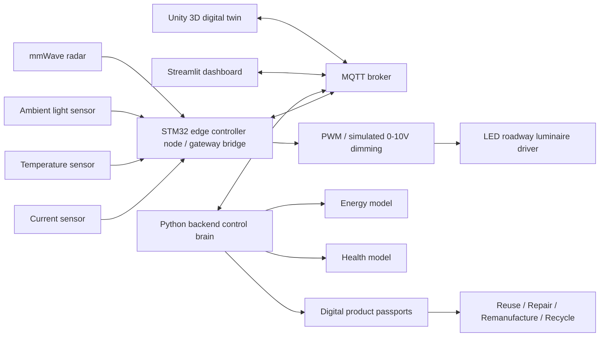
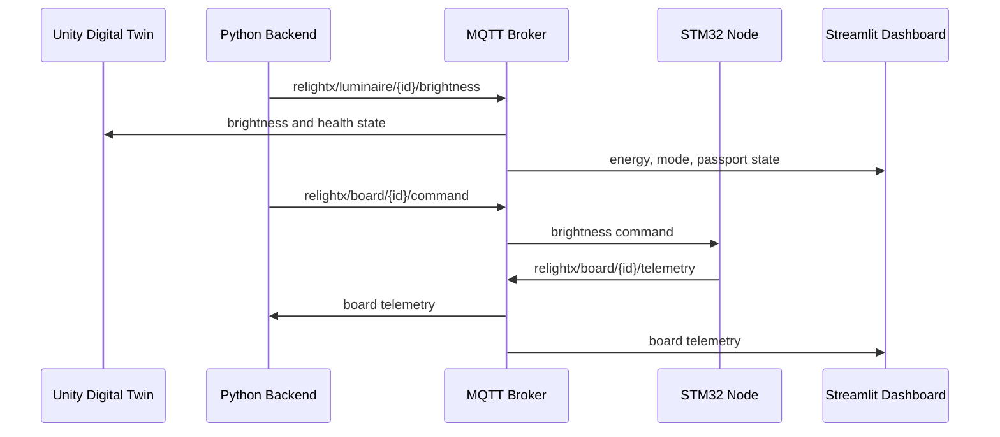
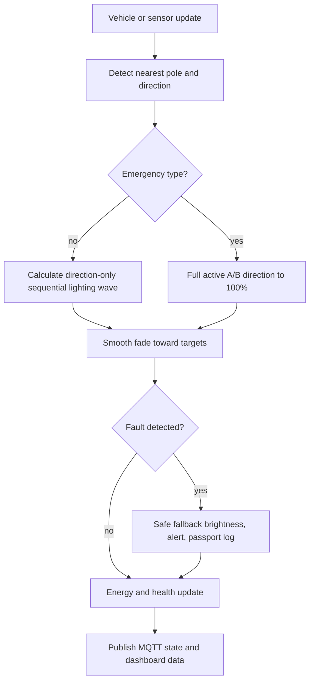
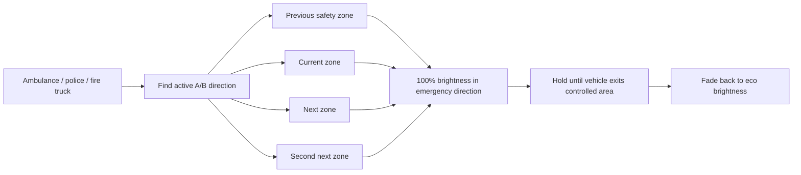
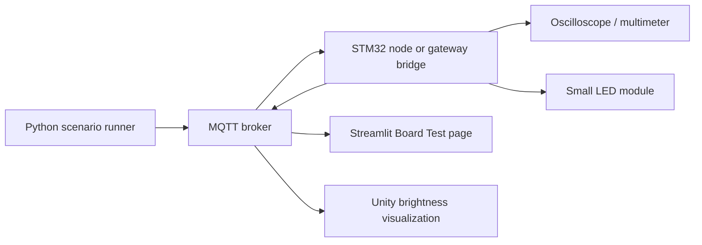
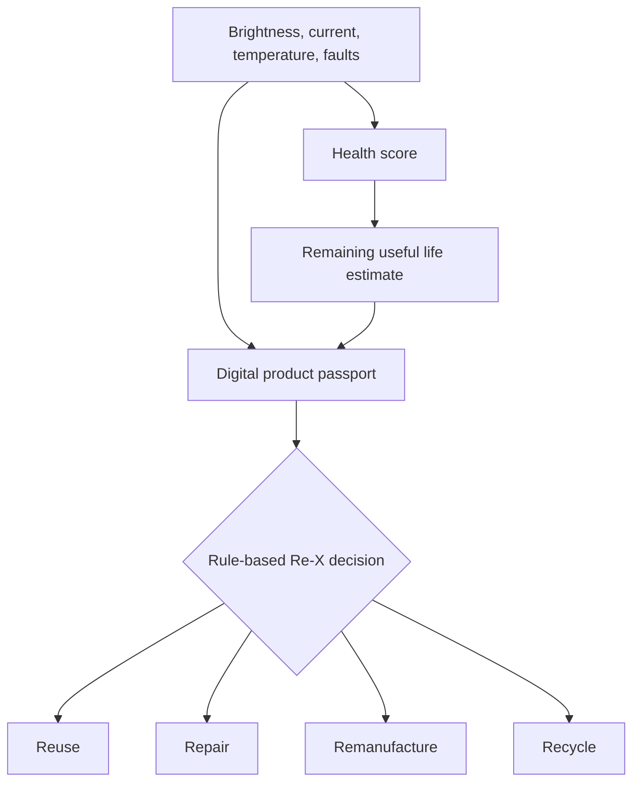

# System Architecture

ReLight-X separates the control brain, digital twin, edge controller, and lifecycle intelligence so each part can be tested independently.

## Full System

## MQTT Data Flow

## Control Flow

## Emergency Mode

## Hardware-in-the-Loop

## Digital Passport and Re-X

